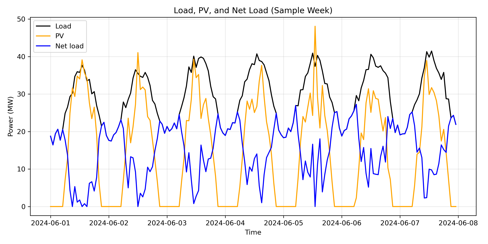
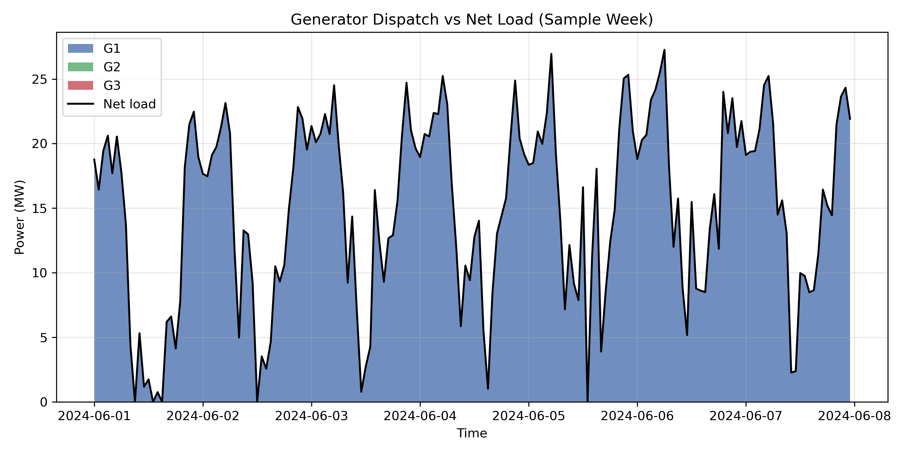
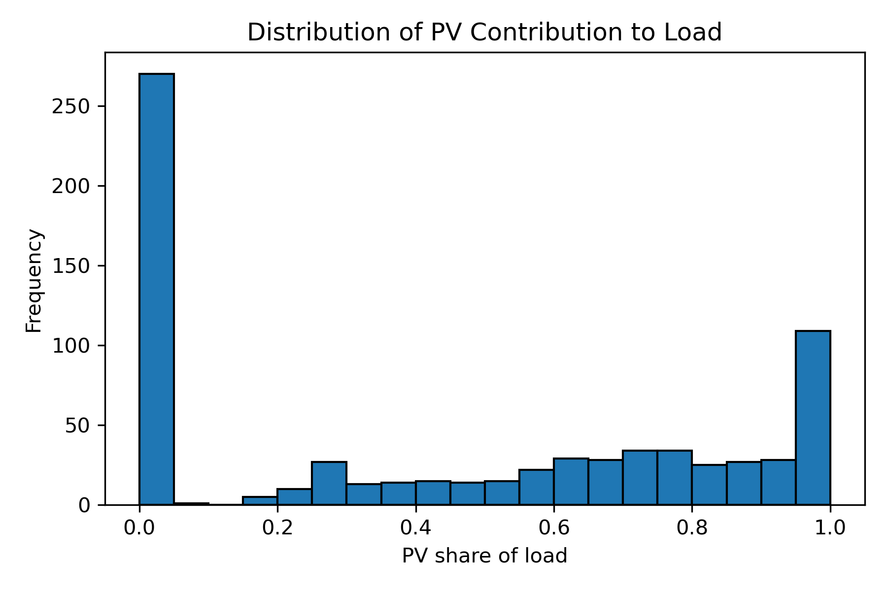

# Introduction

Power systems are increasingly exposed to weather-driven variability as solar PV penetration grows. Grid operators must balance a fluctuating net load (demand minus renewable generation) using dispatchable thermal units, while controlling costs and maintaining reliability.

This capstone project asks:

**How does solar PV variability affect net load, and what is the minimum-cost dispatch strategy for conventional generators given that variability?**

We build an integrated modeling chain:

1. Synthetic but realistic hourly electricity demand  
2. Weather-driven solar PV generation  
3. Net load calculation  
4. Linear programming–based economic dispatch  

This combines time-series modeling, renewable energy simulation, and numerical optimization into a single, coherent framework.

# Methods

## Load Model

We simulate one month of hourly electricity demand with:

- a strong daily cycle (morning/evening peaks),  
- a weekday–weekend effect,  
- random noise.

This reflects typical distribution-level or system-level load behavior.

## Solar PV Model

Solar PV output is modeled as:

- a clear-sky irradiance curve based on hour of day,  
- modified by a stochastic cloud cover process,  
- converted to AC power using a simple efficiency and area model.

This captures both the predictable diurnal pattern and the unpredictable variability introduced by clouds.

## Net Load

Net load is defined as:


\[
\text{Net Load}(t) = \max\left(\text{Load}(t) - \text{PV}(t), 0\right)
\]


This is the demand that must be met by dispatchable generators.

## Dispatch Optimization

We consider three thermal generators with:

- maximum capacities,  
- linear marginal costs,  
- non-negativity constraints.

For each hour \(t\), we choose generator outputs \(g_i(t)\) to:


\[
\min \sum_t \sum_i c_i g_i(t)
\]


subject to:


\[
\sum_i g_i(t) \ge \text{Net Load}(t), \quad 0 \le g_i(t) \le \text{Cap}_i
\]


This is a linear program solved using PuLP with the CBC solver.

# Results

## Load, PV, and Net Load

```{r loadpv, echo=FALSE, out.width="80%"}

```

The sample week illustrates:

- a smooth daily load pattern,  
- a strongly diurnal PV profile modulated by clouds,  
- a net load curve that is reduced and reshaped by PV.

Midday net load is often significantly lower due to PV, while evening net load remains high when PV output drops.

## Dispatch vs Net Load

```{r dispatch, echo=FALSE, out.width="80%"}

```

The stacked area plot shows:

- how the three generators share the burden of meeting net load,  
- preferential use of lower-cost units,  
- higher-cost units ramping up only when net load is high.

This is a classic economic dispatch pattern: cheap units run as much as possible, expensive units fill the residual.

## PV Contribution

```{r pvshare, echo=FALSE, out.width="70%"}

```

The distribution of PV share of load shows:

- many hours with modest PV contribution,  
- some hours where PV covers a large fraction of demand,  
- hours (especially evenings and nights) with negligible PV.

This highlights the challenge of integrating solar: it is valuable but intermittent.

## Total Cost

The total generation cost over the month is stored in:

- `results/total_cost.txt`

This scalar summarizes the economic outcome of the dispatch under the given PV and load conditions.

# Discussion

This integrated model demonstrates several key points:

- **Weather-driven PV reshapes net load**, reducing midday demand on thermal units but leaving evening peaks largely intact.  
- **Economic dispatch naturally prioritizes low-cost generators**, but capacity limits and net load variability require higher-cost units at times.  
- **PV reduces total generation cost**, but also introduces variability that must be managed by flexible conventional units.

From a methodological perspective, this capstone shows your ability to:

- construct realistic time-series models for load and PV,  
- link them into a net load representation,  
- formulate and solve a linear programming dispatch problem,  
- interpret results in both physical and economic terms.

# Conclusion

By combining load modeling, solar PV simulation, and optimal dispatch, this capstone provides a compact but powerful illustration of climate–energy–grid interactions. It demonstrates how weather-driven renewables affect system operations and how optimization can be used to design cost-effective dispatch strategies.

As a portfolio piece, this project integrates your strengths in time-series analysis, energy modeling, and numerical optimization into a single, coherent narrative that is directly relevant to modern power systems and energy analytics roles.
