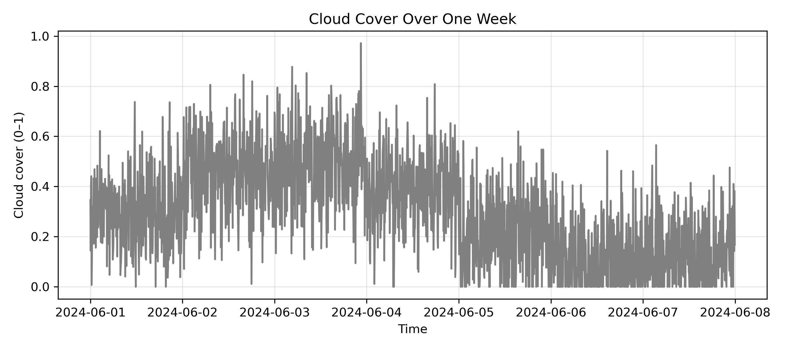
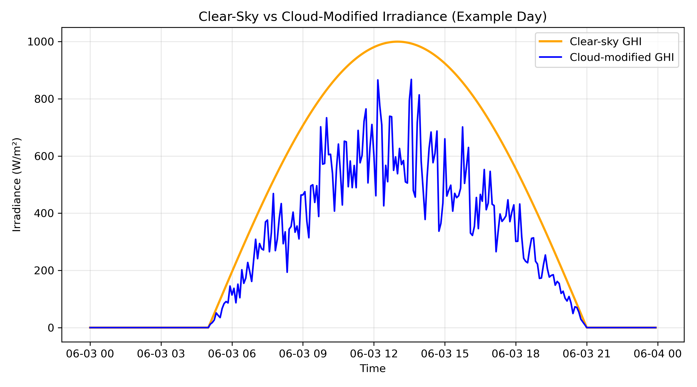
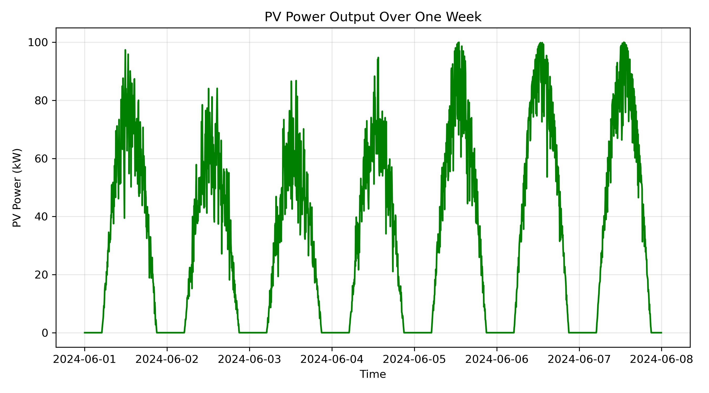
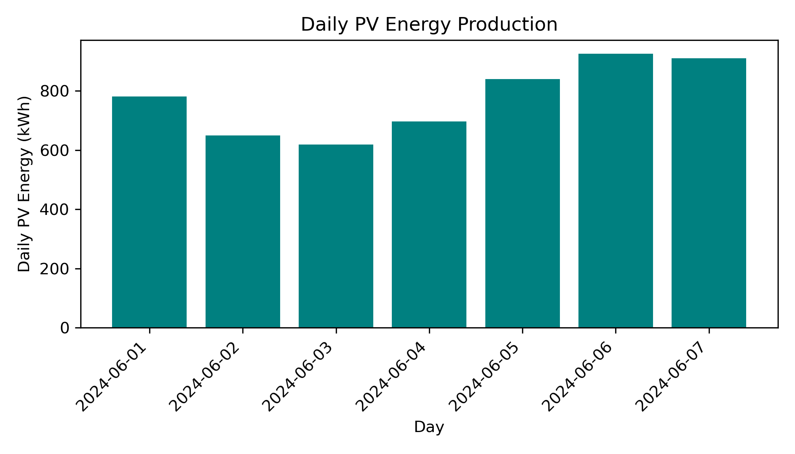

# Introduction

Solar photovoltaic (PV) systems convert sunlight into electricity, but their output is highly sensitive to weather conditions—especially cloud cover. Even on days with similar clear-sky potential, transient clouds can dramatically reduce energy production and introduce variability that grid operators must manage.

This project addresses a focused question:

**How does cloud cover affect solar energy output over the course of a week?**

To answer this, we construct a synthetic but physically interpretable model that links:

- clear-sky solar irradiance,  
- stochastic cloud cover, and 
- PV system power output.

The goal is not to reproduce a specific site, but to demonstrate a coherent modeling chain from weather to energy, suitable for a climate/energy systems portfolio.

# Methods

## Time-Series Framework

We simulate one week of data at 5-minute resolution. This temporal granularity is fine enough to capture intra-day variability while remaining computationally light.

Each timestamp is associated with:

- hour of day,  
- day of year,  
- clear-sky irradiance,  
- cloud cover,  
- cloud-modified irradiance,  
- PV power and energy.

This structure mirrors real operational datasets used in solar forecasting and grid integration studies.

## Clear-Sky Irradiance Model

We approximate clear-sky global horizontal irradiance (GHI) as a smooth bell-shaped function of solar elevation, represented here as a function of hour of day:

- irradiance is zero at night,  
- rises after sunrise,  
- peaks around solar noon,  
- declines toward sunset.

Although simplified, this captures the dominant diurnal pattern of solar resource and provides a baseline against which cloud effects can be measured.

## Cloud Cover and Attenuation

Cloud cover is modeled as a continuous variable between 0 (clear) and 1 (overcast). We construct it as:

- a slowly varying daily pattern (to mimic changing synoptic conditions),  
- plus random noise (to represent short-term variability).

Clouds attenuate irradiance using a simple multiplicative model:


\[
\text{GHI}_\text{eff} = \left(1 - \alpha \cdot \text{cloud\_cover}\right) \cdot \text{GHI}_\text{clear}
\]


where \(\alpha\) is an attenuation factor (here, 0.8). This means that heavy cloud cover can reduce irradiance substantially, while partial cloud cover has a more moderate effect.

## PV System Model

We consider a fixed-size PV system with:

- nameplate capacity (e.g., 100 kW),  
- lumped efficiency parameter,  
- effective area inferred from capacity and efficiency.

DC power output is modeled as:


\[
P_\text{PV}(t) = \eta \cdot A \cdot \frac{\text{GHI}_\text{eff}(t)}{1000}
\]


where:

- \(\eta\) is the efficiency,  
- \(A\) is the effective area,  
- GHI is in W/m²,  
- the factor 1000 converts irradiance to kW/m².

Energy over each 5-minute interval is then:


\[
E(t) = P_\text{PV}(t) \cdot \Delta t
\]


with \(\Delta t\) in hours. Daily energy is obtained by summing over all intervals in a day.

# Results

## Cloud Cover Over the Week

```{r cloud, echo=FALSE, out.width="80%"}

```

The cloud cover time series shows a mix of:

- relatively clear periods,  
- more overcast intervals,  
- day-to-day variability.

This structure is intentional: it creates a realistic testbed where some days are “good solar days” and others are degraded by clouds.

## Clear-Sky vs Cloud-Modified Irradiance (Example Day)

```{r ghi_example, echo=FALSE, out.width="80%"}

```

For a representative day, we compare:

- the **clear-sky GHI** (orange curve),  
- the **cloud-modified GHI** (blue curve).

Key observations:

- The clear-sky curve follows a smooth, symmetric shape around midday.  
- Cloud-modified GHI deviates downward whenever cloud cover increases.  
- Short-term fluctuations in cloud cover translate directly into dips in irradiance.

This figure makes the physical link explicit: clouds act as a time-varying filter on the solar resource.

## PV Power Output Over the Week

```{r pv_week, echo=FALSE, out.width="80%"}

```

The PV power time series inherits structure from both:

- the diurnal cycle of solar irradiance, and  
- the stochastic variability of cloud cover.

We see:

- clear, repeated daily cycles,  
- days with strong, smooth peaks (low cloud cover),  
- days with flattened or jagged peaks (higher cloud cover).

From a systems perspective, this variability is exactly what grid operators must anticipate when integrating solar into the energy mix.

## Daily Energy Production

```{r daily_energy, echo=FALSE, out.width="80%"}

```

Aggregating to daily energy smooths out intra-day fluctuations and reveals:

- which days are high-yield vs low-yield,  
- how much total energy is lost on cloudy days compared to clearer ones.

Even over a single week, the spread in daily energy illustrates the operational challenge: planning around a resource that is both predictable (diurnal pattern) and uncertain (clouds).

# Discussion

This project demonstrates a complete modeling chain from weather to energy:

1. **Clear-sky physics** provides a baseline solar resource.  
2. **Cloud cover** introduces realistic, time-varying attenuation.  
3. **PV modeling** translates irradiance into power and energy.  
4. **Time-series analysis** reveals both short-term variability and daily aggregates.

Key insights:

- Cloud cover does not simply “scale down” solar output uniformly; it introduces structured variability that depends on timing and intensity.  
- Daily energy production can vary significantly from one day to the next, even under the same nominal system and location.  
- Time resolution matters: high-frequency data captures operational variability, while daily aggregates are more relevant for planning and energy yield assessment.

From a portfolio standpoint, this project shows your ability to:

- design a physically grounded simulation,  
- work with time-series data in Python,  
- produce clear, publication-style visualizations,  
- and tell a coherent scientific story from assumptions to implications.

# Conclusion

By simulating solar PV output under variable cloud cover, this project quantifies how weather variability propagates through to energy production. The framework is intentionally simple but extensible: real irradiance data, more detailed PV models, or probabilistic forecasting could be layered on top.

Within your broader climate and energy systems series, this project establishes a solid foundation in solar resource modeling and sets the stage for more advanced work in climate response and grid load forecasting.
