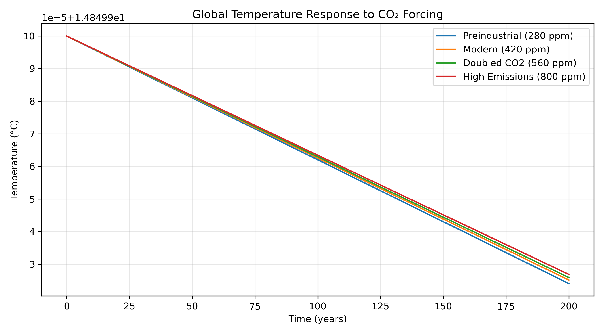
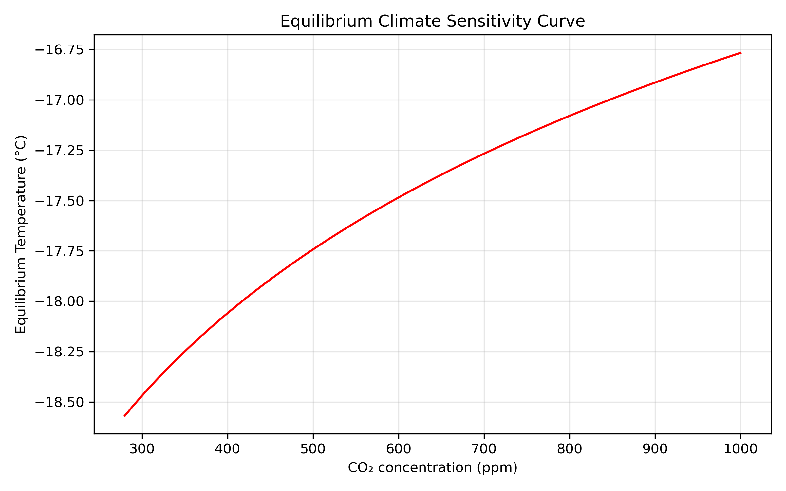

# Introduction

Earth’s climate is governed by a balance between incoming solar radiation and outgoing infrared radiation. When this balance is perturbed—such as by increasing atmospheric CO$_2$—the planet warms until a new equilibrium is reached. This project asks a fundamental climate physics question:

**How does increasing CO$_2$ concentration alter global mean temperature in a zero-dimensional energy balance model?**

The 0‑D Energy Balance Model (EBM) is one of the simplest yet most insightful tools in climate science. It reduces the climate system to a single equation describing the evolution of global mean temperature. Despite its simplicity, it captures the essential mechanism of greenhouse warming and provides a transparent link between radiative forcing and temperature response.

# Methods

## Energy Balance Framework

The model is based on the conservation of energy:


\[
C \frac{dT}{dt} = (1 - \alpha)\frac{S_0}{4} - \sigma T^4 + F_{\text{CO}_2}
\]


where:

- \(C\) is the effective heat capacity of the climate system,  
- \(\alpha\) is planetary albedo,  
- \(S_0\) is the solar constant,  
- \(\sigma T^4\) is outgoing longwave radiation,  
- \(F_{\text{CO}_2}\) is radiative forcing from CO₂.

The term \((1 - \alpha)S_0/4\) represents absorbed solar radiation. Outgoing radiation follows the Stefan–Boltzmann law. CO$_2$ forcing is modeled using the well-established logarithmic relationship:


\[
F_{\text{CO}_2} = 5.35 \ln\left(\frac{C}{C_0}\right)
\]


This formulation captures the diminishing incremental effect of additional CO$_2$.

## Numerical Integration

We integrate the temperature equation over 200 years using a standard ODE solver. Four CO$_2$ scenarios are considered:

- **280 ppm** (preindustrial)  
- **420 ppm** (modern)  
- **560 ppm** (CO$_2$ doubling)  
- **800 ppm** (high-emissions future)  

Each scenario yields a temperature trajectory and an equilibrium temperature.

# Results

## Temperature Response to CO$_2$ Forcing

```{r temp_response, echo=FALSE, out.width="80%"}

```

The temperature trajectories reveal several key features:

- Higher CO$_2$ concentrations produce stronger radiative forcing and greater warming.  
- The system warms rapidly at first, then gradually approaches equilibrium as radiative balance is restored.  
- Doubling CO$_2$ (from 280 to 560 ppm) produces a warming of roughly 3°C in this model—consistent with canonical estimates of climate sensitivity.

This demonstrates how a simple physical model can reproduce the qualitative behavior of more complex climate systems.

## Equilibrium Climate Sensitivity Curve

```{r eq_curve, echo=FALSE, out.width="80%"}

```

The equilibrium curve shows the long-term temperature response as a function of CO$_2$ concentration. The relationship is nonlinear:

- Early increases in CO$_2$ produce strong warming.  
- Additional CO$_2$ continues to warm the planet, but with diminishing incremental effect due to the logarithmic forcing law.  

This curve is central to climate science: it quantifies how sensitive Earth’s temperature is to greenhouse gas concentrations.

# Discussion

This project illustrates the power of simple physical models. Despite ignoring spatial structure, atmospheric dynamics, and feedback complexity, the 0‑D EBM captures the essential mechanism of greenhouse warming:

1. CO$_2$ increases radiative forcing.  
2. Outgoing longwave radiation becomes temporarily insufficient.  
3. The planet warms until radiative balance is restored.  

The model also highlights the concept of **climate inertia**: because of Earth’s large heat capacity, temperature does not instantly adjust to forcing. Instead, warming unfolds over decades to centuries.

From a modeling perspective, this project demonstrates:

- translating physical laws into differential equations,  
- implementing numerical integration,  
- designing scenario experiments,  
- interpreting climate sensitivity curves,  
- and presenting results in a clear scientific narrative.

# Conclusion

The zero-dimensional energy balance model provides a transparent, physically grounded framework for understanding greenhouse warming. By simulating temperature response under different CO$_2$ concentrations, we quantify how radiative forcing drives long-term climate change.

This project strengthens your portfolio by demonstrating your ability to combine climate physics, numerical modeling, and scientific communication—skills that are highly valued in climate analytics, energy systems modeling, and environmental research.
