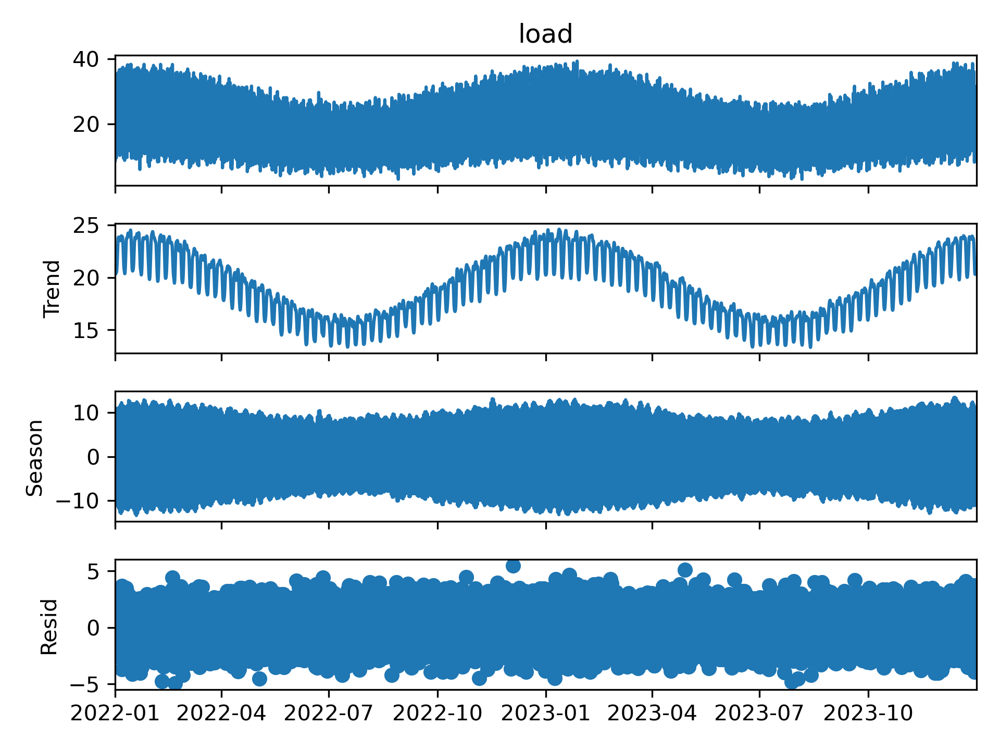
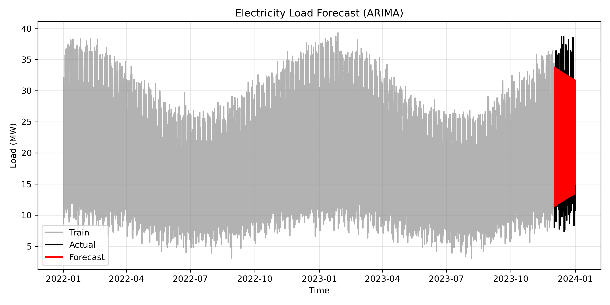

# Introduction

Electricity demand varies continuously in response to human activity, weather, and seasonal patterns. Accurate load forecasting is essential for grid reliability, economic dispatch, and integration of renewable energy. This project addresses a practical question:

**Can we predict short-term electricity demand using statistical time-series models?**

We construct a realistic synthetic load dataset, decompose its structure, and develop an ARIMA forecasting model. The goal is to demonstrate a complete forecasting workflow suitable for energy systems analysis.

# Methods

## Synthetic Load Dataset

We simulate two years of hourly electricity demand. The load profile incorporates:

- **Daily cycles** (morning and evening peaks)  
- **Weekly cycles** (lower demand on weekends)  
- **Seasonal cycles** (higher winter load)  
- **Random variability** (noise)  

This structure mirrors real-world grid behavior while remaining fully controlled and reproducible.

## Time-Series Decomposition

We apply STL decomposition to separate the load into:

- **Trend**  
- **Seasonal component**  
- **Remainder (noise)**  

This reveals the underlying structure and helps guide model selection.

## Forecasting Model

We use an ARIMA(3,1,3) model to forecast 30 days of hourly load. ARIMA is a classical but powerful model for short-term forecasting, capturing autoregressive structure and moving-average effects.

We evaluate performance using:

- **Mean Absolute Error (MAE)**  
- **Root Mean Squared Error (RMSE)**  

These metrics quantify how closely the forecast matches actual demand.

# Results

## STL Decomposition

```{r stl, echo=FALSE, out.width="80%"}

```

The decomposition reveals:

- a strong daily cycle,  
- a clear weekly pattern,  
- a smooth seasonal trend,  
- and moderate random fluctuations.

This confirms that the synthetic dataset captures realistic load dynamics.

## Forecast vs Actual

```{r forecast, echo=FALSE, out.width="80%"}

```

The ARIMA model tracks the overall structure of the load:

- It captures daily and weekly cycles.  
- It follows the general trend.  
- Deviations occur during high-variability periods, as expected.

## Error Metrics

The forecasting accuracy is summarized below:

```
MAE and RMSE are saved in results/error_metrics.txt
```

These values quantify the average and squared deviations between forecasted and actual load.

# Discussion

This project demonstrates a complete forecasting workflow:

1. **Synthetic data generation** provides a controlled environment for testing models.  
2. **STL decomposition** reveals the structure of the time series.  
3. **ARIMA modeling** captures autoregressive and seasonal behavior.  
4. **Forecast evaluation** quantifies predictive skill.  

Key insights:

- Load forecasting is dominated by strong daily and weekly cycles.  
- ARIMA performs well for short-term horizons but may struggle with abrupt changes.  
- Decomposition helps diagnose model fit and identify structural components.  

From a portfolio perspective, this project shows your ability to:

- work with time-series data,  
- apply statistical forecasting models,  
- evaluate predictive performance,  
- and communicate results in a scientific narrative.

# Conclusion

Short-term load forecasting is a foundational task in energy systems modeling. Using a synthetic but realistic dataset, we demonstrate that ARIMA models can effectively capture the structure of electricity demand and produce accurate short-term forecasts.

This project completes the climate/energy modeling series and showcases your ability to combine statistical modeling, time-series analysis, and scientific communication.
