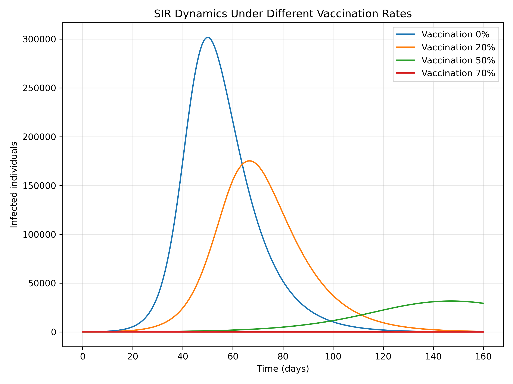
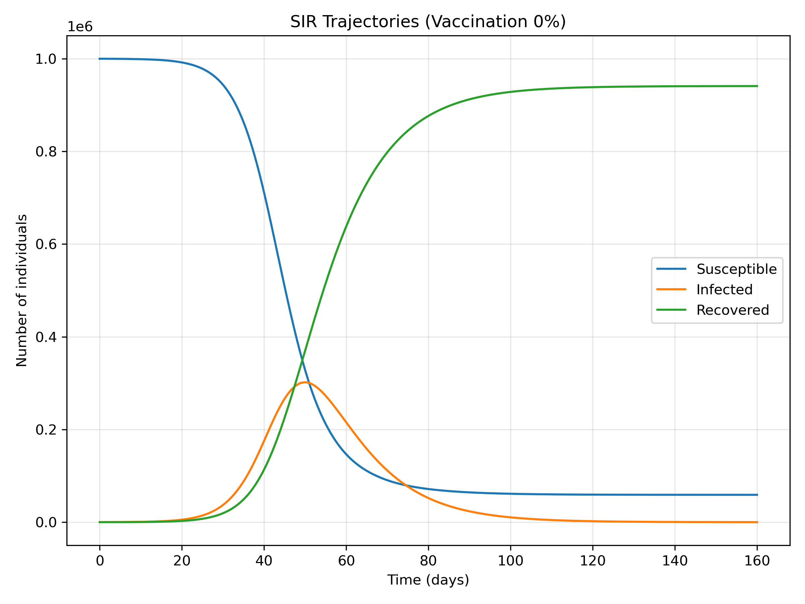
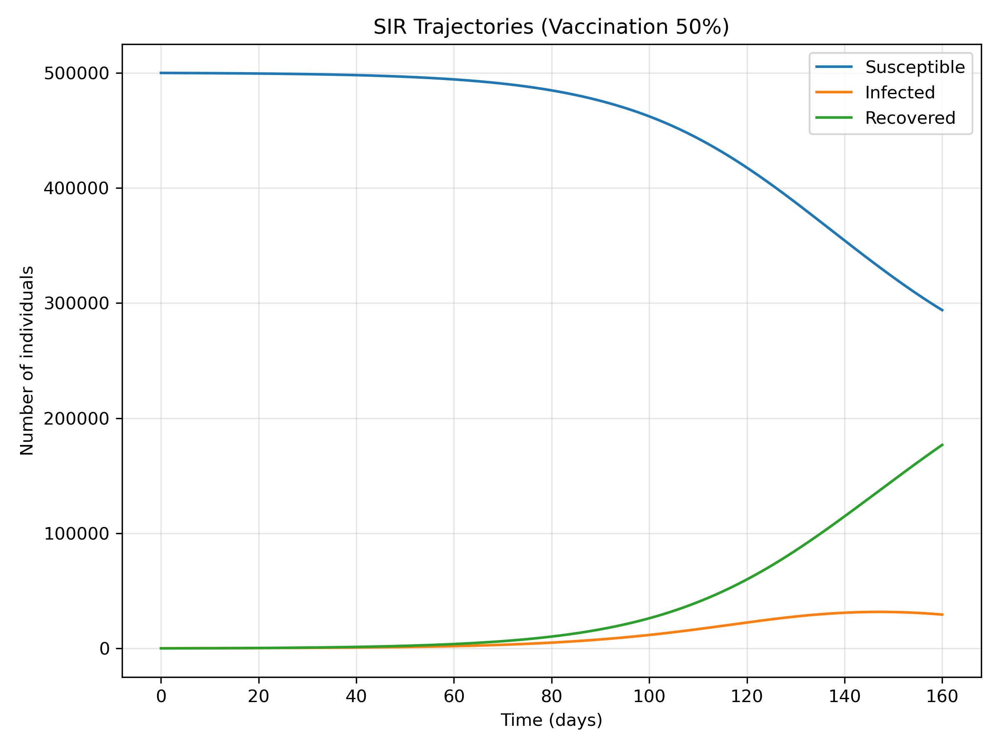

# Introduction

Vaccination is one of the most powerful tools for controlling infectious diseases, yet its impact on outbreak dynamics is often discussed qualitatively rather than quantitatively. This project asks a focused question:

> **How does the vaccination rate affect the size and shape of an outbreak in a simple SIR model?**

To answer this, we build a classical Susceptible–Infected–Recovered (SIR) model and systematically vary the initial vaccination coverage. By comparing epidemic curves across scenarios, we can see how vaccination reshapes the trajectory of an outbreak: peak size, timing, and total number infected.

This project connects directly to core infectious disease modeling concepts from your first Master’s degree: compartmental models, basic reproduction dynamics, and intervention analysis.

# Methods

## Model Structure

We use the standard SIR model with a fixed population size \(N\). The population is divided into three compartments:

- \(S(t)\): Susceptible individuals  
- \(I(t)\): Infected (and infectious) individuals  
- \(R(t)\): Recovered (and immune) individuals  

The dynamics are governed by:


\[
\frac{dS}{dt} = -\beta \frac{S I}{N}, \quad
\frac{dI}{dt} = \beta \frac{S I}{N} - \gamma I, \quad
\frac{dR}{dt} = \gamma I
\]


where:
- \(\beta\) is the transmission rate,
- \(\gamma\) is the recovery rate,
- \(1/\gamma\) is the average infectious period.

## Incorporating Vaccination

Vaccination is modeled as an **initial condition intervention**: a fraction \(v\) of the population is vaccinated at time \(t = 0\) and moved directly into the recovered (immune) compartment.

For a given vaccination rate \(v\):

- Vaccinated individuals: \(V = vN\)  
- Initial infected: \(I_0\) (small seed)  
- Initial recovered: \(R_0 = 0\) (excluding vaccination)  
- Initial susceptible: \(S_0 = N - V - I_0 - R_0\)  

The differential equations remain the same, but the starting point of the system changes. This allows us to isolate the effect of vaccination coverage on outbreak dynamics.

## Numerical Simulation

The SIR system is solved numerically using an ODE solver over a fixed time horizon (e.g., 160 days). We simulate multiple vaccination scenarios:

- 0% vaccinated  
- 20% vaccinated  
- 50% vaccinated  
- 70% vaccinated  

For each scenario, we record the time series of \(S(t)\), \(I(t)\), and \(R(t)\), and then compare the resulting epidemic curves.

# Results

## Infection Curves Across Vaccination Scenarios

The figure below shows the number of infected individuals over time for different vaccination rates. Each curve corresponds to a different initial vaccination coverage.

```{r infected, echo=FALSE, out.width="80%"}

```

As vaccination coverage increases, several patterns emerge:

- The **peak number of infections** decreases substantially.  
- The **timing of the peak** shifts, often occurring earlier but at a much lower magnitude.  
- At high vaccination levels (e.g., 70%), the outbreak may be almost completely suppressed, with only a small bump in infections.

These patterns illustrate how vaccination effectively reduces the pool of susceptible individuals, limiting the virus’s ability to spread.

## Detailed SIR Trajectories: No Vaccination vs. Moderate Vaccination

To better understand the internal dynamics, we compare full SIR trajectories for two contrasting scenarios: 0% and 50% vaccination.

### No Vaccination (0%)

```{r sir0, echo=FALSE, out.width="80%"}

```

In the absence of vaccination:

- The susceptible population \(S(t)\) declines sharply as the infection spreads.  
- The infected curve \(I(t)\) rises rapidly to a high peak, indicating a large outbreak.  
- The recovered curve \(R(t)\) eventually plateaus near the total population, meaning most individuals are infected at some point.

This is the classic uncontrolled epidemic: a large susceptible pool allows the infection to grow explosively.

### Moderate Vaccination (50%)

```{r sir50, echo=FALSE, out.width="80%"}

```

With 50% of the population vaccinated at \(t = 0\):

- The initial susceptible pool is much smaller.  
- The infected curve \(I(t)\) still rises, but the peak is dramatically lower.  
- A substantial fraction of the population remains uninfected throughout the outbreak.

Here, vaccination does not completely prevent transmission, but it **blunts** the epidemic, reducing both peak burden and total infections.

# Discussion

This project demonstrates, in a controlled and transparent way, how vaccination coverage reshapes epidemic dynamics in a simple SIR framework.

Several key insights emerge:

- **Vaccination reduces the effective reproduction potential** by shrinking the susceptible pool. Even without changing \(\beta\) or \(\gamma\), the system behaves as if the disease is less transmissible because fewer people are available to be infected.
- **Outbreak size is highly sensitive to vaccination rate.** Small increases in coverage can lead to large reductions in peak infections and total cases, especially near the threshold where herd immunity effects begin to appear.
- **Initial conditions matter.** The same differential equations produce very different trajectories depending on how the population is distributed across compartments at \(t = 0\). This highlights the importance of early intervention.
- **The SIR model, while simple, is still powerful.** It provides a clear, interpretable framework for reasoning about interventions like vaccination, and it forms the foundation for more complex models (SEIR, age-structured, spatial, stochastic).

From a portfolio perspective, this project shows your ability to:

- Formulate a clear research question.  
- Translate it into a mathematical model.  
- Implement the model numerically.  
- Design and interpret intervention scenarios.  

# Conclusion

By systematically varying vaccination coverage in a classical SIR model, this project quantifies how vaccination reshapes epidemic trajectories. Higher vaccination rates reduce peak infections, total outbreak size, and the burden on the susceptible population.

Although the model is intentionally simple, the insights are directly relevant to real-world public health questions: how much vaccination is “enough,” and what happens if coverage falls short of that threshold?

This project forms the first part of a broader infectious disease modeling series, setting the stage for more detailed work with SEIR models, age structure, and stochastic simulations in subsequent projects.
