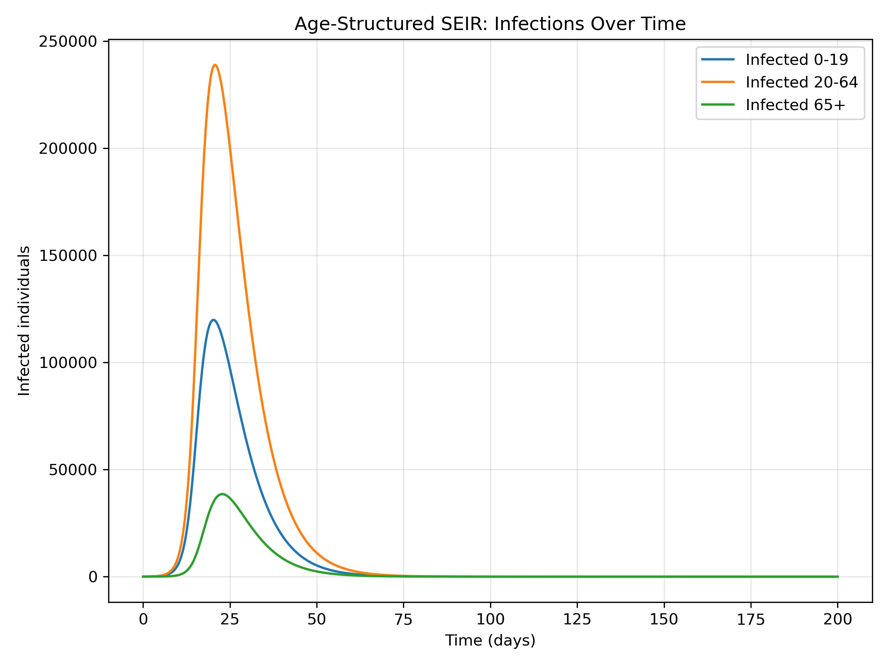
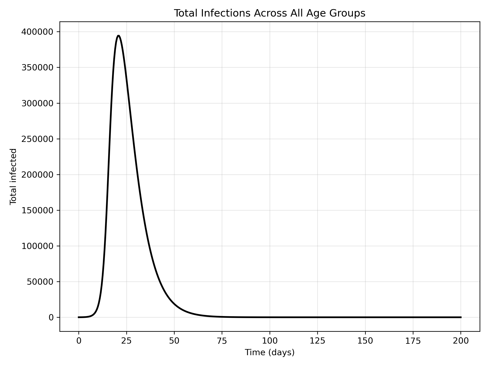

# Introduction

Infectious diseases rarely spread uniformly across a population. Age influences contact patterns, susceptibility, and disease severity. A child in school experiences a very different exposure environment than a retired senior. This project asks a focused question:

**How does age structure change the dynamics of an epidemic in an SEIR model?**

To answer this, we build a multi-compartment SEIR model with three age groups—children, adults, and seniors—connected through a contact matrix. This allows us to capture realistic mixing patterns and observe how infections shift across demographic groups.

This project builds directly on your SIR vaccination work, but adds incubation, heterogeneity, and structured transmission.

# Methods

## SEIR Model Structure

The population is divided into four compartments:

- **S**: Susceptible  
- **E**: Exposed (infected but not yet infectious)  
- **I**: Infectious  
- **R**: Recovered  

The SEIR equations for each age group \(i\) are:


\[
\frac{dS_i}{dt} = -\lambda_i S_i, \quad
\frac{dE_i}{dt} = \lambda_i S_i - \sigma E_i, \quad
\frac{dI_i}{dt} = \sigma E_i - \gamma I_i, \quad
\frac{dR_i}{dt} = \gamma I_i
\]


The force of infection \(\lambda_i\) incorporates age structure:


\[
\lambda_i = \beta \sum_j C_{ij} \frac{I_j}{N_j}
\]


where:

- \(C_{ij}\) is the contact rate between age groups \(i\) and \(j\),
- \(I_j\) is the number of infectious individuals in group \(j\),
- \(N_j\) is the population size of group \(j\).

This formulation allows children to infect adults differently than adults infect seniors, and so on.

## Contact Matrix

The contact matrix encodes how age groups mix:

- Children have high contact with other children.
- Adults mix broadly across groups.
- Seniors have fewer but more structured contacts.

This matrix is the engine that drives heterogeneous transmission.

## Numerical Simulation

The model is solved using numerical integration over 200 days. Initial infections are seeded in all age groups to reflect early community spread.

We track:

- infections within each age group,
- total infections across the population,
- timing and magnitude of peaks.

# Results

## Infections by Age Group

```{r infected_age, echo=FALSE, out.width="80%"}

```

Several patterns emerge:

- **Children experience the earliest and highest peak**, driven by dense contact patterns.
- **Adults follow**, reflecting their intermediate mixing.
- **Seniors peak last and lowest**, but remain vulnerable due to smaller population size and slower spread.

The staggered peaks illustrate how age structure naturally creates multiple “waves” within a single epidemic.

## Total Infections Across All Groups

```{r total_infected, echo=FALSE, out.width="80%"}

```

The total infection curve smooths over the age-specific peaks, producing a single broad epidemic wave. This highlights a key insight:

**Aggregate epidemic curves can hide important demographic dynamics.**

# Discussion

This project demonstrates how age structure fundamentally reshapes epidemic behavior:

- **Transmission is not uniform**—children amplify early spread, adults sustain it, seniors experience delayed exposure.
- **Contact patterns matter as much as biological parameters.**
- **Interventions may need to be age-targeted** (e.g., school closures, protecting seniors).

Compared to the SIR vaccination model, this SEIR framework adds:

- incubation period realism,
- demographic heterogeneity,
- structured mixing.

These additions bring the model closer to real-world epidemiology and set the stage for even richer simulations.

# Conclusion

Age structure introduces complexity that cannot be captured by simple homogeneous models. By incorporating a contact matrix and multi-group SEIR dynamics, we reveal how different demographic groups experience the same epidemic in different ways.

This project strengthens your portfolio by demonstrating your ability to:

- build multi-compartment ODE systems,
- incorporate demographic structure,
- interpret heterogeneous epidemic dynamics.

It also prepares the ground for the next project: **stochastic epidemic simulation using Monte Carlo**, where randomness becomes the driving force behind outbreak variability.
