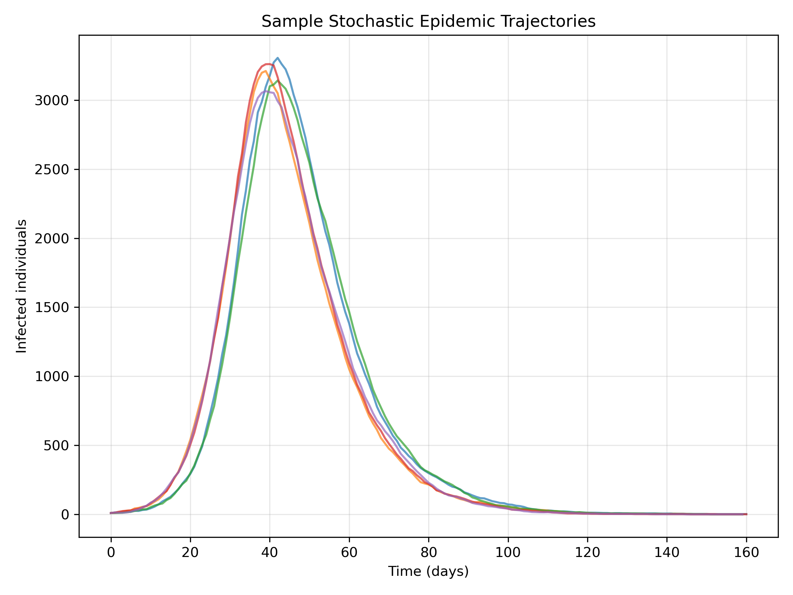
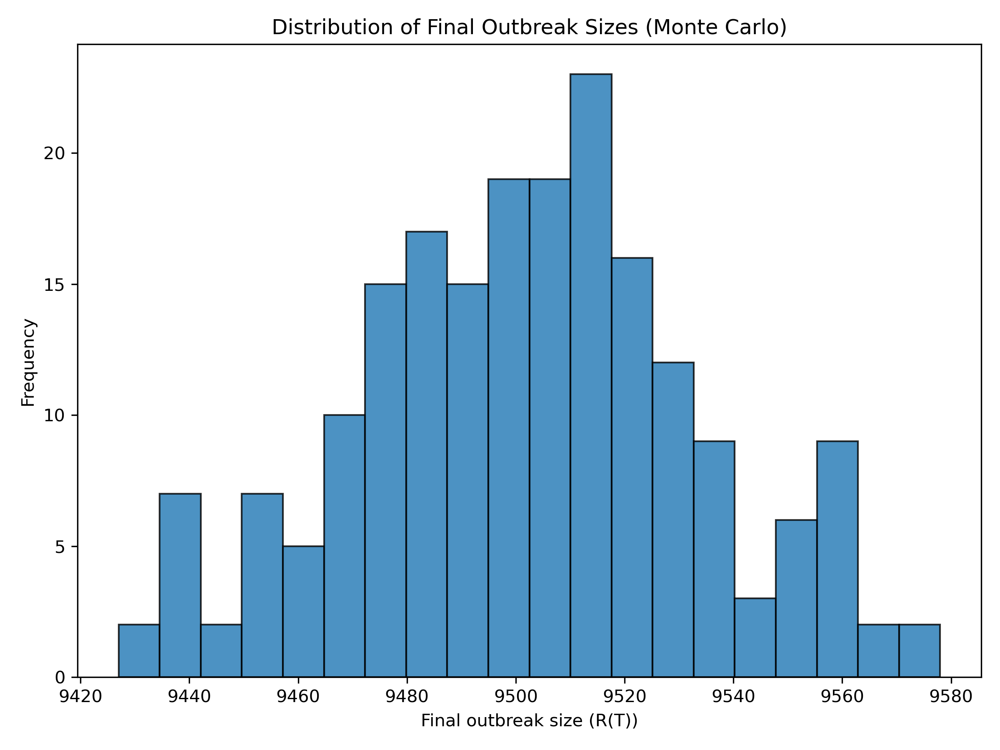

# Introduction

Deterministic epidemic models, like the SIR and SEIR systems built earlier, describe the *average* behavior of an outbreak. In reality, however, epidemics are shaped by chance: who meets whom, when an infection happens, and whether a chain of transmission dies out early or explodes.

This project asks:

**How does randomness affect outbreak outcomes in an SIR model?**

To answer this, we construct a stochastic SIR model and run many Monte Carlo simulations. Instead of a single epidemic curve, we obtain a *distribution* of possible outbreaks, revealing how variable epidemic size can be even under identical parameters.

# Methods

## Stochastic SIR Framework

We keep the same compartments as before:

- \(S(t)\): Susceptible  
- \(I(t)\): Infected  
- \(R(t)\): Recovered  

But instead of differential equations, we model **daily transitions** as random events:

- New infections are drawn from a binomial distribution based on the probability that a susceptible individual is infected by the current infectious pool.
- Recoveries are drawn from a binomial distribution based on the probability that an infected individual recovers on a given day.

This yields a discrete-time, stochastic SIR process. Each simulation run is one possible realization of the epidemic.

## Monte Carlo Simulation

We fix:

- population size \(N\),  
- transmission parameter \(\beta\),  
- recovery rate \(\gamma\),  
- initial infected \(I_0\).

We then:

1. Simulate the epidemic day by day until a fixed horizon or until infections die out.  
2. Record the full trajectory \(S(t), I(t), R(t)\).  
3. Repeat this process many times (e.g., 200 runs).  

From these runs, we extract:

- sample infection trajectories,  
- the final outbreak size \(R(T)\) for each run,  
- the distribution of final sizes.

# Results

## Sample Stochastic Trajectories

```{r traj, echo=FALSE, out.width="80%"}

```

Each line represents one possible epidemic under the same parameters and initial conditions. Several patterns are visible:

- Some outbreaks grow quickly and reach a high peak.  
- Others grow more slowly or peak at a lower level.  
- A few may fade out relatively early if chance events break transmission chains.

This variability is **not** captured by deterministic models, which always produce the same smooth curve.

## Distribution of Final Outbreak Sizes

```{r finaldist, echo=FALSE, out.width="80%"}

```

The histogram shows the distribution of final outbreak sizes across all Monte Carlo runs. Even with identical parameters:

- Some simulations result in relatively small outbreaks.  
- Others infect a large fraction of the population.  

This spread reflects the inherent randomness in who gets infected and when.

# Discussion

This project highlights a crucial point in infectious disease modeling:

> **Deterministic models describe the average epidemic, but real epidemics are single stochastic realizations.**

Key insights:

- **Randomness can prevent or trigger large outbreaks.** Even when the basic reproduction number suggests a major epidemic is likely, chance can still lead to early extinction.
- **Policy decisions must account for variability.** Planning for only the “average” outcome can underestimate risk.
- **Monte Carlo simulation is a natural extension of compartmental models.** It connects clean mathematical structure with realistic uncertainty.

From a portfolio perspective, this project shows that you can move beyond ODEs into stochastic processes and simulation-based inference—exactly the kind of depth employers look for in modeling roles.

# Conclusion

By simulating many stochastic SIR epidemics, this project reveals how outbreak outcomes can vary widely under fixed parameters. The deterministic SIR curve is just one point in a broader distribution of possibilities.

Together with your previous SIR vaccination and age-structured SEIR projects, this work forms a coherent infectious disease modeling series that demonstrates:

- mathematical modeling skills,  
- numerical implementation,  
- stochastic thinking,  
- and clear scientific storytelling.
