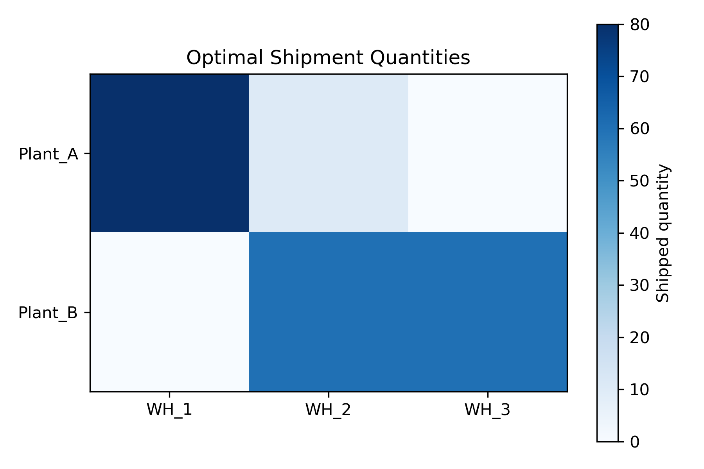
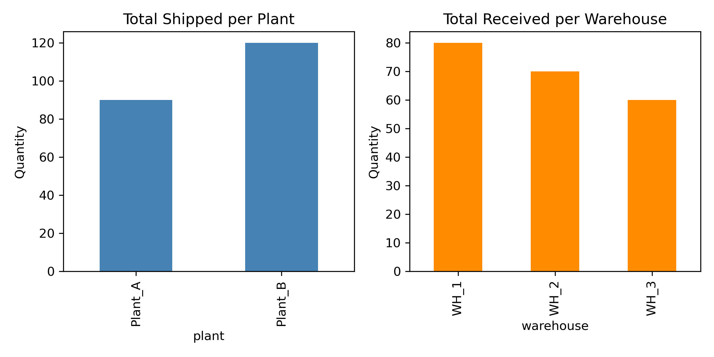

# Introduction

Modern supply chains must move goods from production sites to demand centers at minimum cost while respecting capacity and demand constraints. This project asks:

**What is the minimum-cost distribution strategy for a simple plant–warehouse network?**

We formulate the problem as a classical **transportation model**, a special case of linear programming. The objective is to minimize total transportation cost subject to supply limits at plants and demand requirements at warehouses.

This project showcases applied mathematical optimization with a clear operational interpretation.

# Methods

## Problem Structure

We consider:

- Two production plants (sources)  
- Three warehouses (sinks)  
- Known supply at each plant  
- Known demand at each warehouse  
- A unit transportation cost for each plant–warehouse pair  

Decision variables represent the quantity shipped from each plant to each warehouse. The optimization problem is:

- **Objective:** minimize total transportation cost  
- **Constraints:**  
  - Shipments from each plant do not exceed its supply  
  - Shipments into each warehouse meet or exceed its demand  

This is a linear programming problem with a clear physical meaning.

## Mathematical Formulation

Let \(x_{ij}\) be the quantity shipped from plant \(i\) to warehouse \(j\), \(c_{ij}\) the unit cost, \(s_i\) the supply at plant \(i\), and \(d_j\) the demand at warehouse \(j\).

**Objective:**


\[
\min \sum_{i,j} c_{ij} x_{ij}
\]


**Subject to:**


\[
\sum_j x_{ij} \le s_i \quad \text{(supply constraints)}
\]


\[
\sum_i x_{ij} \ge d_j \quad \text{(demand constraints)}
\]


\[
x_{ij} \ge 0
\]


We solve this using a linear programming solver (PuLP with CBC).

# Results

## Optimal Shipment Pattern

```{r heatmap, echo=FALSE, out.width="70%"}

```

The heatmap shows the optimal shipment quantities from each plant to each warehouse. Darker cells correspond to higher flows.

Interpretation:

- Shipments concentrate along the lowest-cost routes.  
- Some plant–warehouse links may carry zero flow if they are relatively expensive.  
- The pattern reflects a balance between cost minimization and the need to satisfy all demands within supply limits.

## Flow Summary

```{r flow_summary, echo=FALSE, out.width="80%"}

```

The bar charts summarize:

- **Total shipped per plant:** how much each plant contributes to the network.  
- **Total received per warehouse:** how much demand is met at each location.

These plots confirm that:

- Plant shipments do not exceed their capacities.  
- Warehouse receipts meet or exceed their demands.  

The optimization allocates flows efficiently across the network.

## Total Cost

The optimized total transportation cost is stored in:

- `results/total_cost.txt`

This scalar value represents the minimum achievable cost under the given assumptions.

# Discussion

This project demonstrates how linear programming can be used to design cost-efficient supply chain strategies. Key points:

- The transportation model provides a clean mathematical abstraction of logistics decisions.  
- The optimal solution is not obvious by inspection; it emerges from solving the LP.  
- Sensitivity analysis (e.g., changing costs, supplies, or demands) can reveal how robust the solution is to parameter changes.

From a portfolio perspective, this project shows your ability to:

- formulate real-world problems as optimization models,  
- implement linear programs in Python,  
- interpret solutions in operational terms,  
- and present results with clear visualizations.

# Conclusion

By modeling a simple plant–warehouse network as a transportation problem, we obtain a minimum-cost distribution strategy that satisfies all supply and demand constraints. This project highlights the power of linear programming in supply chain design and sets the stage for more advanced optimization work, such as portfolio optimization and nonlinear process optimization.
