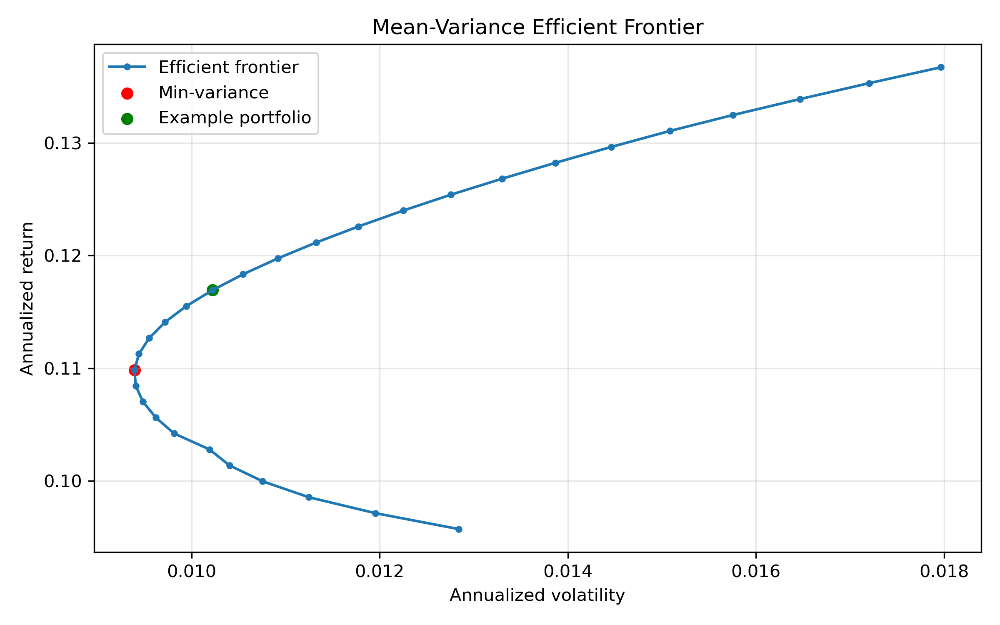
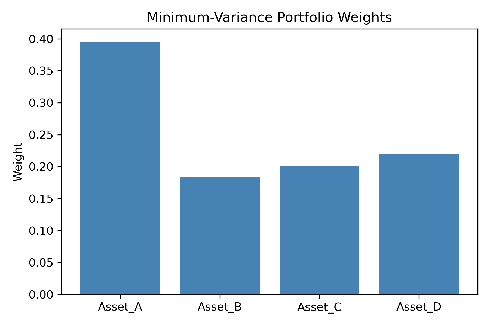
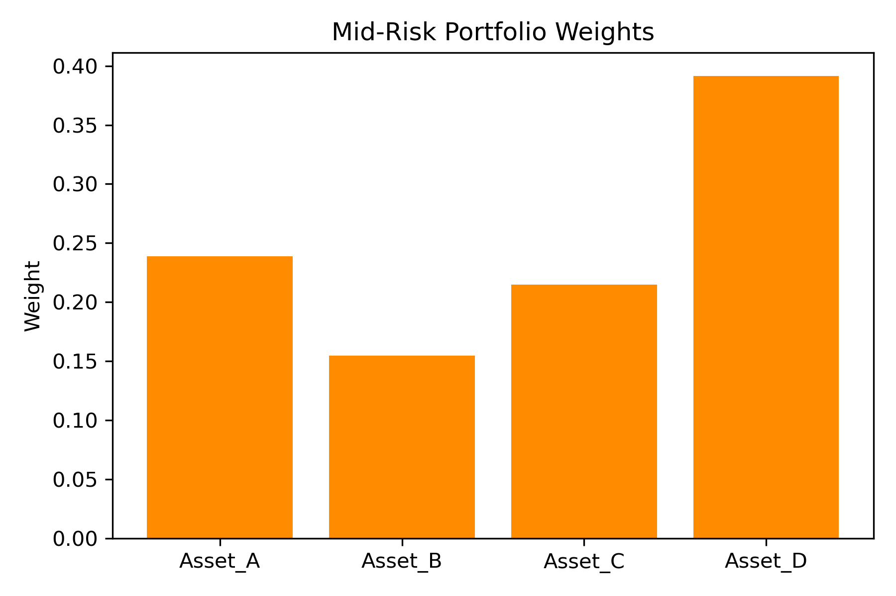

# Introduction

Modern Portfolio Theory (MPT) provides a quantitative framework for balancing risk and return in financial portfolios. Rather than selecting assets in isolation, MPT considers how assets interact through their covariance structure and seeks portfolios that are efficient: no other portfolio offers higher return for the same risk.

This project asks:

**How do we construct an optimal risk–return portfolio using mean–variance optimization?**

We build a synthetic multi-asset return dataset, estimate mean returns and covariance, and compute the mean–variance efficient frontier using quadratic programming. We then highlight specific portfolios, including the minimum-variance portfolio.

# Methods

## Data and Assumptions

We simulate daily returns for four assets with:

- distinct expected returns,  
- a realistic covariance structure,  
- moderate correlations.

From these simulated returns, we estimate:

- the vector of mean returns \(\mu\),  
- the covariance matrix \(\Sigma\).

These estimates serve as inputs to the optimization problem.

## Mean–Variance Optimization

Let \(w\) be the vector of portfolio weights, \(\mu\) the expected returns, and \(\Sigma\) the covariance matrix.

- **Expected portfolio return:**


\[
R_p = \mu^\top w
\]


- **Portfolio variance:**


\[
\sigma_p^2 = w^\top \Sigma w
\]


We construct the **efficient frontier** by solving:


\[
\min_{w} \quad w^\top \Sigma w
\]


subject to:


\[
\mu^\top w = R_{\text{target}}, \quad \sum_i w_i = 1, \quad w_i \ge 0
\]


for a range of target returns \(R_{\text{target}}\). This yields portfolios with minimum variance for each desired return level.

The optimization is implemented as a quadratic program using CVXOPT.

# Results

## Efficient Frontier

```{r frontier, echo=FALSE, out.width="80%"}

```

The efficient frontier shows the trade-off between risk (volatility) and return:

- The curve is upward sloping: higher expected return requires higher risk.  
- Portfolios below the frontier are inefficient: they offer lower return for the same risk.  
- The minimum-variance portfolio lies at the leftmost point of the frontier.

This visualization is central to MPT and provides an intuitive picture of optimal diversification.

## Portfolio Weights

### Minimum-Variance Portfolio

```{r minvar, echo=FALSE, out.width="70%"}

```

The minimum-variance portfolio emphasizes assets that:

- have low individual volatility,  
- and/or are weakly correlated with others.

The resulting allocation spreads risk across assets to minimize overall variance.

### Mid-Risk Portfolio

```{r midrisk, echo=FALSE, out.width="70%"}

```

A mid-risk portfolio on the frontier shifts weight toward higher-return assets while maintaining diversification. This illustrates how the efficient frontier can be used to tailor portfolios to different risk appetites.

# Discussion

This project demonstrates the core ideas of Modern Portfolio Theory:

- **Risk is a portfolio property**, not just an asset property.  
- **Diversification** can reduce risk without sacrificing return, up to a point.  
- The **efficient frontier** summarizes the best achievable trade-offs between risk and return.  

From a modeling perspective, you have:

- formulated the mean–variance problem as a quadratic program,  
- implemented it using a numerical optimization library,  
- generated and interpreted the efficient frontier,  
- and examined specific optimal portfolios.

These are exactly the skills expected in quantitative finance, risk analytics, and optimization-heavy roles.

# Conclusion

By constructing and analyzing the mean–variance efficient frontier, this project shows how Modern Portfolio Theory can be used to design portfolios that optimally balance risk and return. The combination of synthetic data, quadratic programming, and clear visualization makes this a strong, self-contained demonstration of applied optimization in a financial context.
