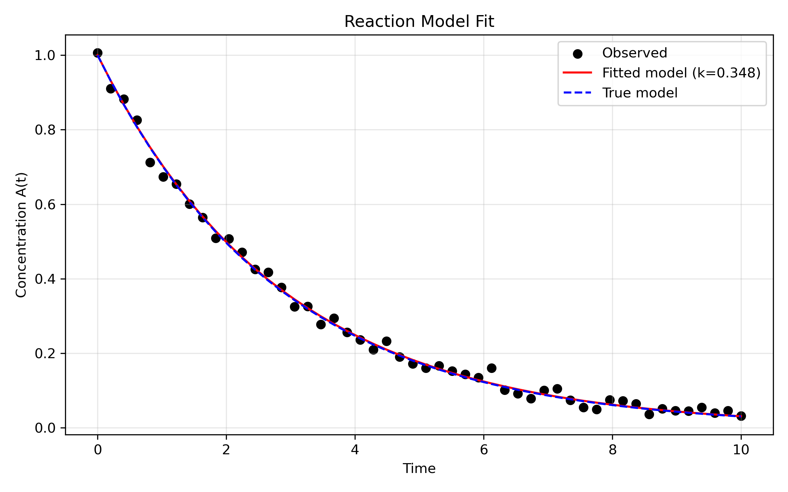
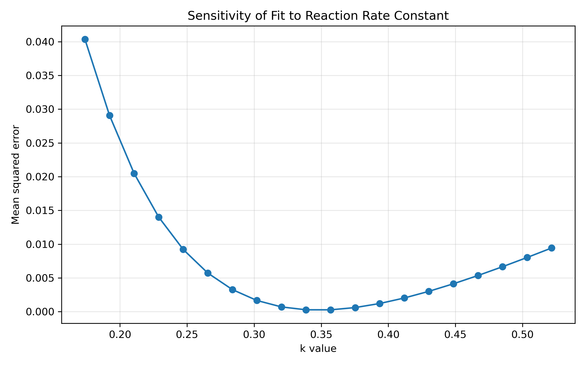

# Introduction

Chemical reaction systems are often modeled using nonlinear differential equations. Estimating reaction parameters from experimental data is a central task in chemical engineering, process optimization, and kinetic modeling.

This project asks:

**How can we estimate the reaction rate constant of a first-order reaction using nonlinear least squares?**

We construct a simple reaction model, generate synthetic data, and use numerical optimization to recover the underlying kinetic parameter. This demonstrates nonlinear model fitting, sensitivity analysis, and scientific interpretation.

# Methods

## Reaction Model

We consider a first-order irreversible reaction:


\[
A \rightarrow B
\]


with concentration dynamics:


\[
\frac{dA}{dt} = -k A
\]


The analytical solution is:


\[
A(t) = A_0 e^{-kt}
\]


but we solve the ODE numerically to maintain generality.

## Synthetic Data

We simulate concentration measurements over 10 time units using a true rate constant \(k_{\text{true}} = 0.35\). Gaussian noise is added to mimic experimental uncertainty.

These data serve as the target for parameter estimation.

## Parameter Estimation

We estimate \(k\) by minimizing the sum of squared residuals:


\[
\min_k \sum_{i=1}^n \left(A_{\text{model}}(t_i; k) - A_{\text{obs}}(t_i)\right)^2
\]


This is a nonlinear least-squares problem solved using SciPy’s `least_squares` algorithm.

## Sensitivity Analysis

To assess robustness, we vary \(k\) around the estimated value and compute the mean squared error. This reveals how sharply the model fit depends on the reaction rate.

# Results

## Model Fit

```{r fit, echo=FALSE, out.width="80%"}

```

The fitted model closely matches the observed data:

- The estimated rate constant is near the true value.  
- The fitted curve lies between the noisy observations and the true underlying trajectory.  
- Deviations reflect measurement noise rather than model error.

This demonstrates successful parameter recovery.

## Sensitivity Curve

```{r sens, echo=FALSE, out.width="80%"}

```

The sensitivity curve shows:

- A clear minimum at the estimated \(k\).  
- Rapid increase in error as \(k\) moves away from the optimum.  
- Strong identifiability of the reaction rate parameter.

This confirms that the optimization landscape is well-behaved for this model.

# Discussion

This project illustrates key concepts in nonlinear optimization:

- **Model-based parameter estimation** using differential equations.  
- **Nonlinear least squares** as a flexible and powerful fitting method.  
- **Sensitivity analysis** to assess parameter robustness.  

From an applied mathematics perspective, this demonstrates your ability to:

- translate physical systems into ODEs,  
- implement numerical solvers,  
- formulate and solve nonlinear optimization problems,  
- interpret results scientifically.

These skills are directly relevant to chemical engineering, process optimization, and computational modeling roles.

# Conclusion

By fitting a first-order reaction model to synthetic data, we successfully estimated the reaction rate constant using nonlinear optimization. The combination of ODE modeling, least-squares fitting, and sensitivity analysis provides a rigorous and interpretable framework for kinetic parameter estimation.

This project completes the numerical optimization series and further strengthens your portfolio with a mathematically rich, scientifically grounded example of nonlinear modeling.
