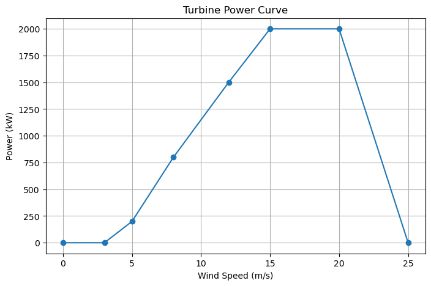
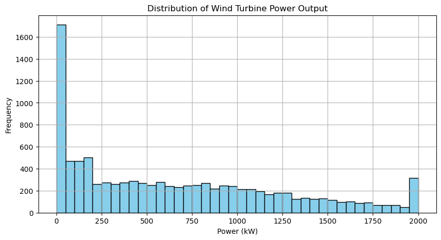

# Wind Turbine Power Curve Simulation

## Executive Summary

This project simulates the power output of a single wind turbine using a Weibull wind speed distribution and a simplified turbine power curve. By generating thousands of wind speed samples and mapping them through the power curve, we obtain a realistic distribution of expected power output over time.

The results show that most power production occurs around the turbine’s rated region, with relatively fewer hours at very low or very high wind speeds. This highlights both the importance of site-specific wind characteristics and the inherent variability of wind power.

This simulation provides a foundational building block for more advanced wind farm studies, including wake effects, layout optimization, and energy yield assessment across multiple turbines.

---

## 1. Introduction

Wind turbines convert kinetic energy from wind into electrical power.  
The relationship between wind speed and power output is described by a **power curve**, which specifies how much power a turbine produces at different wind speeds.

Because wind is highly variable, we use a **Weibull distribution** to model realistic wind speed patterns.  
This notebook simulates thousands of wind speed samples and computes the corresponding power output using a turbine power curve.

---

## 2. Methodology

### 2.1 Weibull Wind Speed Distribution

Wind speeds are modeled using a Weibull distribution with parameters:

- **k**: shape parameter  
- **c**: scale parameter  

The probability density function is:

\[
f(v; k, c) = \frac{k}{c} \left(\frac{v}{c}\right)^{k-1} e^{-(v/c)^k}
\]

### 2.2 Turbine Power Curve

A turbine power curve maps wind speed (m/s) to power output (kW).  
We use a simplified curve with:

- Cut-in speed  
- Rated speed  
- Cut-out speed  

### 2.3 Simulation Pipeline

1. Generate wind speeds  
2. Load power curve  
3. Interpolate power output  
4. Visualize results  

---

## 3. Results

### Turbine Power Curve

### Power Output Distribution

The simulation produced 10,000 samples of wind speed and corresponding power output.  
The histogram shows a skewed distribution, with most values clustered around the rated power region (800–1500 kW).  
This reflects the turbine’s efficiency range and the shape of the Weibull distribution.

---

## 4. Conclusion

This simulation demonstrates how wind speed variability affects turbine power output.  
Using a Weibull distribution and a simplified power curve, we modeled realistic performance over thousands of samples.

This forms a foundation for more advanced wind farm modeling, including wake effects, terrain optimization, and layout design.

Next steps:
- Use real wind speed data from public sources  
- Compare different turbine models  
- Extend to multi-turbine simulations
