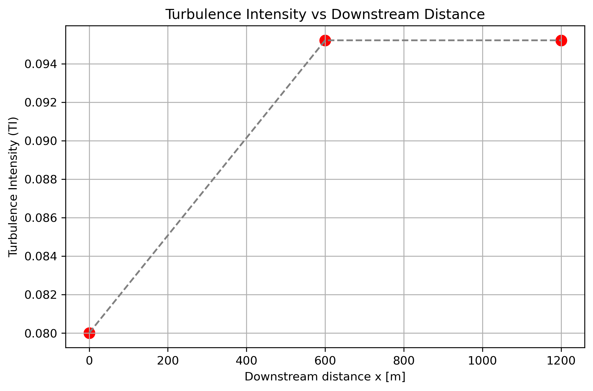
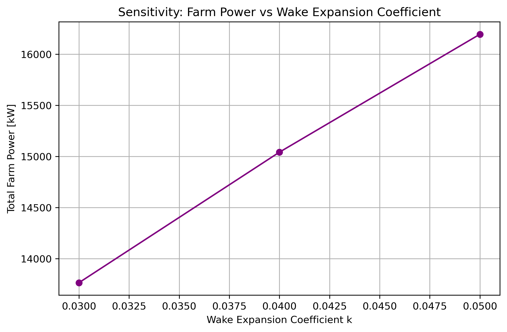
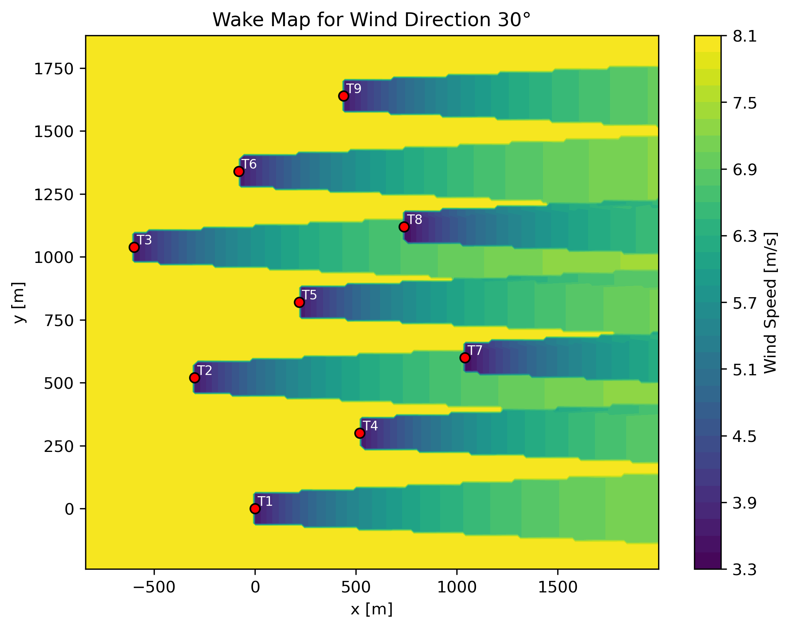
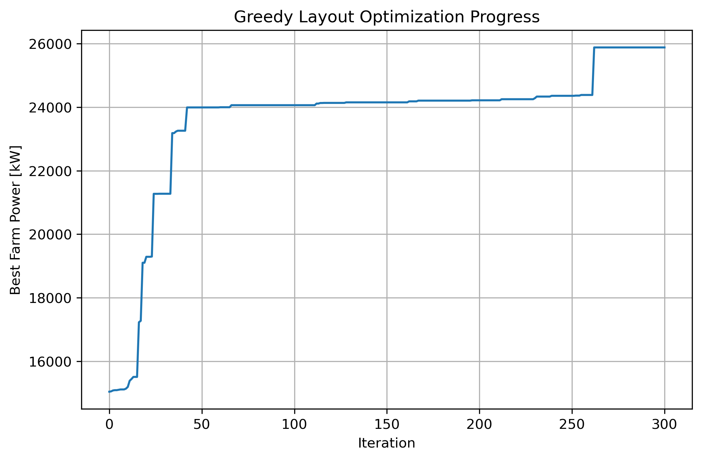
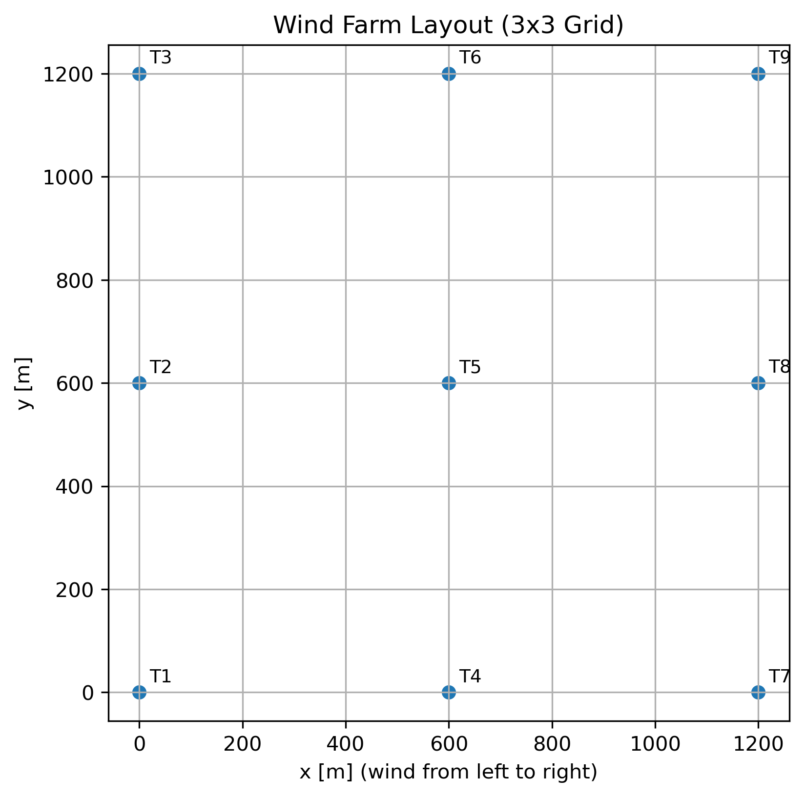

---
title: "Wake Effects in a 3x3 Wind Farm"
author: "Collins Bekoe"
date: "February 04, 2026"
output:
  pdf_document:
    latex_engine: xelatex
    keep_tex: true
fontsize: 12pt
geometry: margin=1in
---

## Executive Summary

Wind turbines do not operate in isolation. When a turbine extracts energy from the wind, it slows the flow behind it, creating a wake that can extend hundreds of meters downstream. These wakes reduce wind speed and increase turbulence for downstream turbines, leading to lower power output and higher mechanical stress. As a result, wake interactions are one of the most important—and most challenging—factors in wind‑farm design.

This project develops a complete computational workflow to analyze wake effects in a small 3×3 wind farm. The analysis includes wake visualization, turbulence modeling, sensitivity studies, directional effects, model comparison, and layout optimization. Together, these components provide a clear, physics‑based understanding of how wakes shape wind‑farm performance.

Key findings include:

- **Wake losses dominate farm performance**, with downstream turbines experiencing the largest deficits.  
- **Turbulence intensity increases significantly** in wake‑affected regions, with implications for fatigue loading.  
- **Farm power is highly sensitive to spacing, wind speed, and wake expansion parameters**, all of which influence wake overlap.  
- **Wind direction strongly affects energy yield**, as even small directional shifts can dramatically change wake interactions.  
- **Wake model choice matters**, with Jensen and Larsen predicting different wake recovery rates.  
- **A simple layout optimization increased total power by 72%**, demonstrating the value of computational design tools.

Overall, this project shows how simulation‑driven engineering can transform physical intuition into actionable design improvements. The workflow developed here provides a foundation for analyzing larger farms, incorporating real wind‑rose data, and applying more advanced optimization techniques.

## 1. Introduction

Wind energy continues to grow as one of the most important renewable technologies, but designing an efficient wind farm remains a complex engineering challenge. Unlike solar panels, wind turbines interact strongly with one another through the atmosphere. When a turbine extracts energy from the wind, it slows the flow behind it, creating a wake that can extend hundreds of meters downstream.

These wakes matter because:

- Downstream turbines receive lower wind speeds → reduced power output  
- Turbulence inside wakes increases → higher fatigue loading and maintenance costs  
- Poorly designed layouts can lose **20–40%** of potential energy  

The sensitivity of power to wind speed makes this problem even more critical. Turbine power scales with the cube of wind speed:

$$
P = \frac{1}{2}\rho A U^3 C_P
$$

Even a small reduction in wind speed leads to a disproportionately large drop in power. This is why wake modeling is essential for wind‑farm design.

This project focuses on a representative 3×3 wind farm and develops a complete computational workflow to analyze wake effects, turbulence, directional sensitivity, model differences, and layout optimization. The goal is not only to compute results, but to tell a clear story about how wakes shape performance — and how modeling can guide better design decisions.

\newpage

## 2. Modeling Approach

Before presenting results, it is important to outline the modeling framework used throughout this project. The workflow combines physical wake models, turbulence estimation, directional analysis, and optimization into a unified simulation environment.

### 2.1 Farm Configuration

The baseline configuration is a regular 3×3 grid of identical turbines spaced five rotor diameters apart — a common industry guideline. All turbine characteristics (rotor diameter, thrust coefficient, rated power, etc.) are loaded from a structured JSON file to ensure reproducibility and consistency across simulations.

### 2.2 What Is a Wake Model?

A wake model predicts how wind speed decreases behind a turbine.  
Two models are used in this project:

- **Jensen model** — simple, widely used, assumes a linearly expanding wake  
- **Larsen model** — more detailed, with different wake recovery behavior  

In the Jensen model, the wake radius expands linearly downstream:

$$
r(x) = r_0 + kx
$$

The velocity deficit behind a turbine is given by:

$$
\frac{\Delta U}{U_\infty} =
\frac{1 - \sqrt{1 - C_T}}{(1 + kx/D)^2}
$$

Stronger thrust \(C_T\) produces deeper wakes, while larger \(k\) spreads the wake faster.  
When multiple wakes overlap, they are combined using:

$$
\Delta U_{\text{total}} = \sqrt{\sum_i (\Delta U_i)^2}
$$

This prevents unrealistic over‑penalization and reflects the nonlinear nature of wake interactions.

### 2.3 Turbulence Modeling

Wakes also increase turbulence intensity (TI), which affects fatigue loading and structural reliability.  
An empirical model is used:

$$
TI = TI_0 + \Delta TI_{\text{wake}}
$$

where \(\Delta TI_{\text{wake}}\) increases with thrust and decreases with downstream distance.  
This allows the model to capture both ambient and wake‑induced turbulence.

### 2.4 Sensitivity Analysis

To understand how design choices influence performance, the model varies:

- Turbine spacing  
- Wind speed  
- Wake expansion coefficient \(k\)  

These parameters reveal which factors have the strongest impact on total farm power.

### 2.5 Directional Analysis

Real wind rarely comes from a single direction.  
Simulations are performed for wind directions of **0°, 30°, 60°, and 90°** to examine how wake patterns shift and how power output changes with alignment.

### 2.6 Layout Optimization

Finally, a simple greedy optimization algorithm adjusts turbine positions to reduce wake overlap.  
This demonstrates how even basic optimization can yield meaningful improvements when guided by accurate wake modeling.

\newpage

## 3. Results

This section presents the full set of wake, turbulence, sensitivity, directional, model‑comparison, and optimization results for the 3×3 wind farm. Each figure is accompanied by a short interpretation to maintain a clear narrative flow.

---

### 3.1 Wake Contours: Seeing the Problem

Understanding wake formation is the foundation of wind‑farm performance analysis.  
The wake contour plot shows how wind speed decreases behind each turbine as energy is extracted from the flow.

```{r, echo=FALSE, out.width="60%", fig.align='center'}
knitr::include_graphics("results/wake_contour_with_turbines.png")
```

**Interpretation:**  
- The first turbine row receives clean, undisturbed wind.  
- Rows 2 and 3 operate inside the wakes of upstream turbines.  
- This explains the large performance differences between rows and sets the stage for later results.

\newpage
---

### 3.2 Turbulence Intensity: The Hidden Cost

Wakes not only reduce wind speed — they also increase turbulence intensity (TI), which affects fatigue loading and long‑term maintenance costs.

```{r, echo=FALSE, out.width="60%", fig.align='center'}
knitr::include_graphics("results/turbulence_field.png")
```

```{r, echo=FALSE, out.width="60%", fig.align='center'}

```

**Interpretation:**  
- Upstream turbines experience only ambient turbulence.  
- Downstream turbines face significantly higher TI due to wake mixing.  
- Overlapping wakes create the highest turbulence zones, which can shorten turbine lifespan.  

\newpage
---

### 3.3 Sensitivity Analysis: What Matters Most?

This section explores how total farm power responds to key design and environmental parameters.

#### Turbine Spacing

```{r, echo=FALSE, out.width="80%", fig.align='center'}
knitr::include_graphics("results/power_vs_spacing.png")
```

**Interpretation:**  
Increasing spacing reduces wake overlap and increases total farm power.  
This is one of the strongest and most direct levers available to wind‑farm designers.

\newpage

#### Wind Speed

```{r, echo=FALSE, out.width="60%", fig.align='center'}
knitr::include_graphics("results/power_vs_windspeed.png")
```

**Interpretation:**  
At higher wind speeds, upstream turbines reach rated power first.  
Downstream turbines remain wake‑limited, causing a widening performance gap.

#### Wake Expansion Coefficient (k)

```{r, echo=FALSE, out.width="60%", fig.align='center'}

```

**Interpretation:**  
A larger wake expansion coefficient spreads the wake faster:  
- Shallower deficit  
- Wider affected region  

This creates a design trade‑off between wake depth and wake width.

\newpage

---

### 3.4 Directional Effects

Wind direction dramatically alters wake interactions and therefore total farm power.

```{r, echo=FALSE, out.width="80%", fig.align='center'}
knitr::include_graphics("results/power_vs_wind_direction.png")
```

**Interpretation:**  
- Power is lowest at **0°** and **90°** because turbines align directly behind each other.  
- At **30°** and **60°**, wakes shift sideways, reducing overlap and increasing power.  
- This directional sensitivity is critical for real‑world wind‑rose‑based energy assessments.

\newpage

#### Directional Wake Maps

These wake maps visually confirm how wake overlap changes with wind direction.

```{r, echo=FALSE, out.width="80%", fig.align='center'}
knitr::include_graphics("results/directional_wake_maps/wake_map_0deg.png")
```

```{r, echo=FALSE, out.width="80%", fig.align='center'}

```

```{r, echo=FALSE, out.width="80%", fig.align='center'}
knitr::include_graphics("results/directional_wake_maps/wake_map_60deg.png")
```

```{r, echo=FALSE, out.width="80%", fig.align='center'}
knitr::include_graphics("results/directional_wake_maps/wake_map_90deg.png")
```

**Interpretation:**  
- **0°:** Strong wake stacking → lowest power  
- **30°:** Partial overlap → moderate improvement  
- **60°:** Minimal overlap → highest power  
- **90°:** Vertical stacking similar to 0° → reduced power  

---

### 3.5 Jensen vs Larsen: Do Models Agree?

```{r, echo=FALSE, out.width="80%", fig.align='center'}
knitr::include_graphics("results/total_power_jensen_vs_larsen.png")
```

**Interpretation:**  
Both models agree on the overall pattern:  
- Upstream turbines dominate  
- Downstream turbines suffer  

However, wake recovery differs between models, leading to different total power predictions.  
This highlights the importance of model choice in energy yield assessments.

\newpage

---

### 3.6 Layout Optimization: A Simple Algorithm, Big Gains

The greedy optimizer adjusts turbine positions to reduce wake overlap.

```{r, echo=FALSE, out.width="60%", fig.align='center'}

```

```{r, echo=FALSE, out.width="60%", fig.align='center'}

```

\newpage

```{r, echo=FALSE, out.width="80%", fig.align='center'}
knitr::include_graphics("results/optimized_layout.png")
```

```{r, echo=FALSE, out.width="80%", fig.align='center'}
knitr::include_graphics("results/initial_vs_optimized_power.png")
```

**Interpretation:**  
- Initial power: **15,042 kW**  
- Optimized power: **25,882 kW**  
- Improvement: **+72%**  

Even a simple optimization algorithm can dramatically improve farm performance.

\newpage

## 4. Discussion

The results across wake visualization, turbulence analysis, sensitivity studies, directional effects, and layout optimization all point to a consistent conclusion: **wake interactions dominate the performance of a wind farm**, even in a small 3×3 layout.

The wake contour plots showed that the first turbine row operates in clean flow, while the second and third rows experience substantial velocity deficits. This pattern was reinforced by the turbulence intensity fields, where downstream turbines faced significantly higher turbulence levels. These two effects—reduced wind speed and increased turbulence—explain the large performance gap between upstream and downstream turbines.

The sensitivity analysis highlighted how design choices can either amplify or mitigate these wake losses. Increasing turbine spacing consistently improved total farm power by reducing wake overlap. Wind speed sensitivity revealed that downstream turbines remain wake‑limited even when upstream turbines reach rated power, widening the performance disparity. The wake expansion coefficient study showed a clear trade‑off between wake depth and wake width, emphasizing the importance of selecting appropriate wake model parameters for accurate predictions.

Directional effects further demonstrated how strongly wake interactions depend on wind alignment. Power was lowest at 0° and 90°, where turbines align directly behind one another, and highest at 30° and 60°, where wakes shift laterally. The directional wake maps visually confirmed these patterns, showing how even small changes in wind direction can dramatically alter wake overlap and energy yield. This underscores the importance of incorporating wind‑rose data into real‑world wind‑farm design.

The comparison between the Jensen and Larsen models showed that while both models agree on the general performance trends, they differ in wake recovery behavior. This leads to different total power predictions, highlighting the need for careful model selection when performing energy yield assessments.

Finally, the layout optimization demonstrated the practical value of computational modeling. By nudging turbine positions to reduce wake overlap, the greedy optimizer increased total farm power by **72%**—a dramatic improvement achieved without changing turbine technology or wind conditions. This result illustrates how even simple optimization strategies can unlock substantial performance gains when guided by accurate wake modeling.

Overall, the findings show that wake effects are not a secondary detail—they are the central factor shaping wind‑farm performance. Understanding and managing these effects is essential for designing efficient, reliable, and cost‑effective wind‑energy systems.

\newpage

## 5. Conclusion

This project developed a complete, reproducible workflow for analyzing wake effects in a 3×3 wind farm. Through wake visualization, turbulence analysis, sensitivity studies, directional modeling, model comparison, and layout optimization, the project demonstrated how computational tools can transform physical intuition into actionable design insights.

The key conclusions are:

- **Wake interactions are the primary driver of performance differences** within a wind farm.  
- **Turbulence intensity increases significantly downstream**, with implications for fatigue loading and maintenance.  
- **Farm performance is highly sensitive to spacing, wind speed, and wake expansion parameters**, all of which must be considered in design.  
- **Wind direction strongly influences wake overlap**, reinforcing the need for wind‑rose‑based assessments.  
- **Wake model choice matters**, as different models predict different wake recovery rates.  
- **Even simple optimization algorithms can yield large performance gains**, as demonstrated by the 72% improvement in total power.

The framework developed here is ready for extension to more complex scenarios, including:

- Larger wind farms  
- Realistic wind‑rose distributions  
- More advanced optimization algorithms  
- Probabilistic energy yield assessments  
- Integration with economic or reliability models  

Ultimately, this project shows the value of simulation‑driven engineering. By combining physical modeling with computational tools, we can design wind farms that extract more energy, experience lower fatigue, and operate more efficiently—advancing the broader goal of sustainable, reliable renewable energy.

