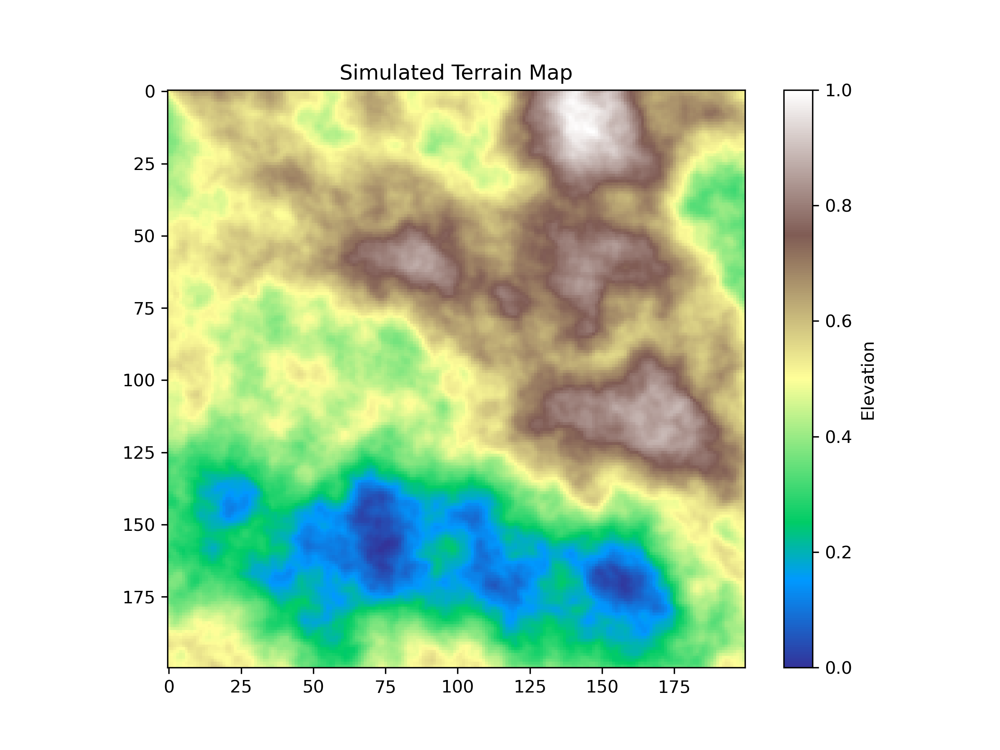
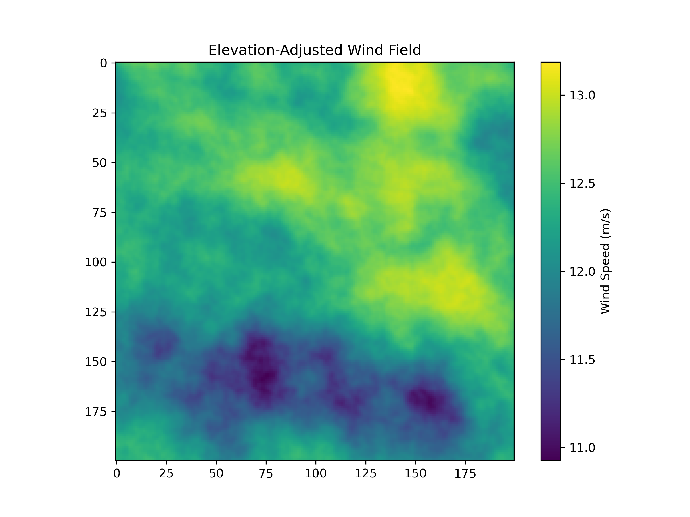
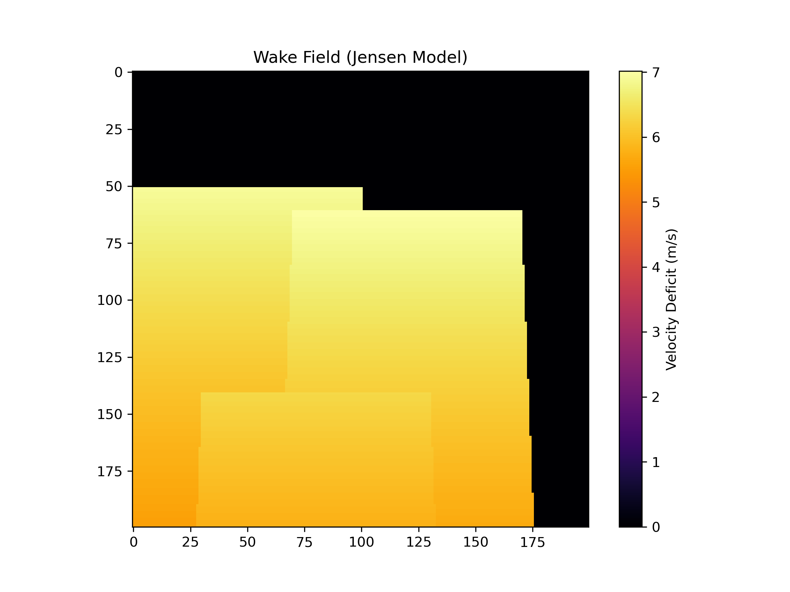
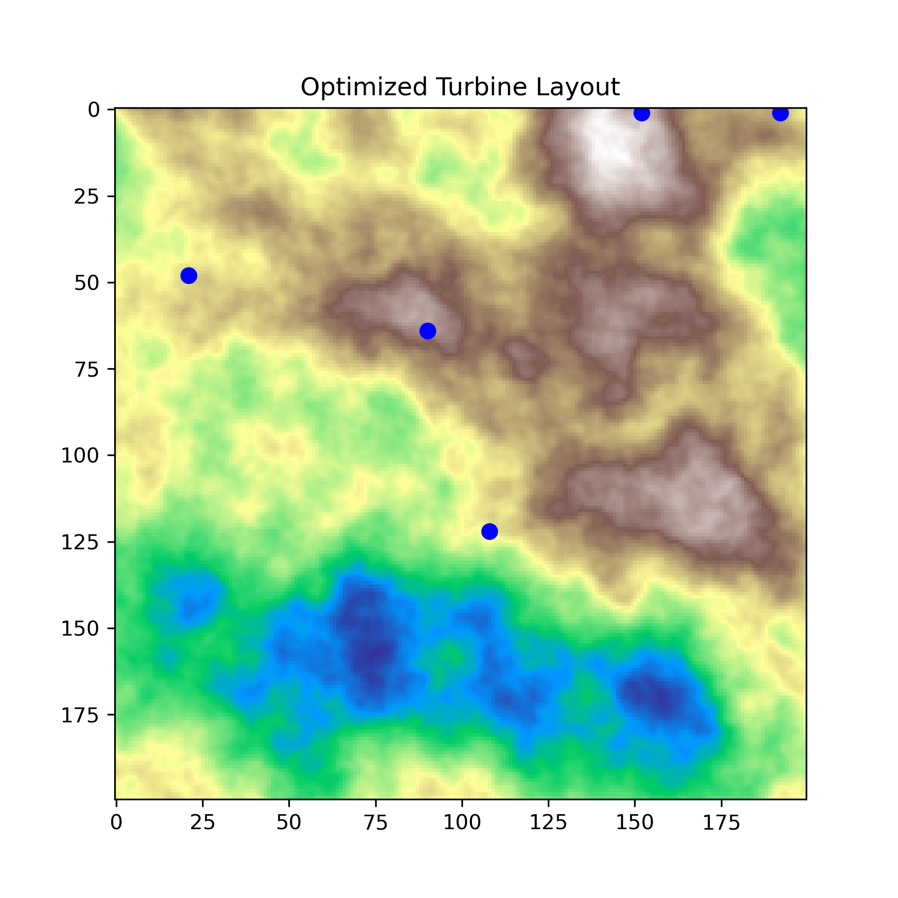
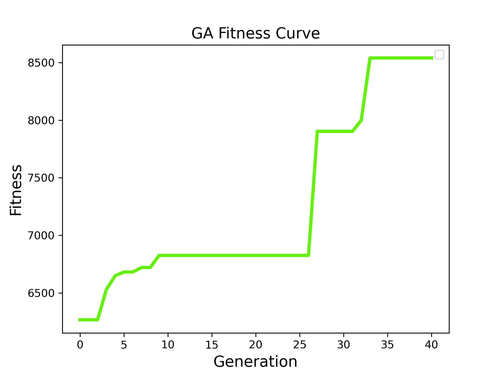

# Introduction

Wind energy systems are shaped by a delicate interplay between terrain, atmospheric physics, and turbine interactions. The placement of turbines within a wind farm is not merely a geometric exercise—it is a complex optimization problem influenced by elevation-driven wind shear, wake losses, and spatial constraints. Poor placement can lead to significant reductions in energy output, while thoughtful optimization can unlock substantial performance gains.

This project develops a complete, simulation-driven workflow for optimal turbine placement on a synthetic terrain map. The workflow integrates four major components:

1. **Terrain modeling** using Perlin noise to generate a realistic digital elevation model (DEM).  
2. **Wind resource modeling** using an elevation-adjusted wind shear equation.  
3. **Wake modeling** using the Jensen model to quantify velocity deficits behind turbines.  
4. **Evolutionary optimization** using a genetic algorithm to search for high-performing layouts.

The goal is to demonstrate how physical modeling and computational optimization can be combined to design efficient wind farm layouts, even in the absence of real-world terrain or wind data.

# Methods

## Terrain Generation

Real terrain influences wind speed through elevation, slope, and surface roughness. To capture these effects without relying on external datasets, a synthetic DEM was generated using Perlin noise. This method produces smooth, natural-looking hills and valleys that mimic real landscapes while remaining fully controllable and reproducible.

The resulting terrain map provides the foundation for all subsequent modeling steps.

```{r terrain, echo=FALSE, out.width="80%"}

```

## Wind Shear Model

Wind speed increases with height above ground due to reduced surface friction. On uneven terrain, this effect becomes spatially variable: turbines placed on elevated ridges experience stronger winds than those in valleys.

To capture this phenomenon, the wind field was computed using the power-law wind shear equation:


\[
U(z) = U_{\text{ref}} \left( \frac{z}{z_{\text{ref}}} \right)^\alpha
\]


where:
- \( U_{\text{ref}} \) is the reference wind speed,
- \( z_{\text{ref}} \) is the reference height,
- \( \alpha \) is the shear exponent,
- \( z \) is the effective height (hub height + terrain elevation).

This produces a spatially varying wind resource map that reflects the influence of terrain.

```{r windfield, echo=FALSE, out.width="80%"}

```

## Wake Model

Turbines extract kinetic energy from the wind, creating a wake of reduced wind speed downstream. These wakes can significantly reduce the performance of neighboring turbines. To model this effect, the Jensen wake model was used:


\[
\Delta U = U_0 \left(1 - \sqrt{1 - C_T}\right)
\left(1 + k \frac{x}{D/2}\right)^{-2}
\]


This model captures the widening and weakening of the wake as it travels downstream. Although simplified, it is widely used in wind farm research and provides a computationally efficient way to estimate wake losses.

An example wake field is shown below.

```{r wakefield, echo=FALSE, out.width="80%"}

```

## Optimization Framework

Wind farm layout optimization is a high-dimensional, non-convex problem with many local optima. Evolutionary algorithms are well-suited for such problems because they explore the search space broadly and do not rely on gradient information.

A genetic algorithm (GA) was used to evolve turbine positions. Each candidate solution encodes the \((x, y)\) coordinates of all turbines. The fitness function combines:

- **Total energy output**, computed from the wake-adjusted wind speeds.  
- **Spacing penalties**, ensuring turbines remain sufficiently separated.  

Over successive generations, the GA improves the layout by selecting high-performing solutions and introducing variation through crossover and mutation.

# Results

## Initial Layout

The initial layout is generated randomly and serves as a baseline for comparison. It typically contains suboptimal placements, including turbines positioned in low-wind regions or directly in the wakes of others.

```{r initial, echo=FALSE, out.width="80%"}

```

## Optimized Layout

After running the GA, the optimized layout shows clear improvements. Turbines migrate toward elevated, high-wind regions and spread out laterally to minimize wake interactions. The resulting configuration reflects a balance between terrain advantages and aerodynamic constraints.

```{r optimized, echo=FALSE, out.width="80%"}

```

## Fitness Curve

The fitness curve illustrates the GA’s progress over generations. Early generations show rapid improvement as poor layouts are discarded. Later generations refine the solution, converging toward a stable, high-performing configuration.

```{r fitness, echo=FALSE, out.width="80%"}

```

# Discussion

This project demonstrates how terrain, wind physics, and turbine interactions jointly shape wind farm performance. Several key insights emerge:

- **Terrain matters**: Elevated regions consistently offer stronger winds due to the wind shear effect. The optimizer naturally gravitates toward these areas.
- **Wake effects are significant**: Turbines placed directly behind others experience substantial energy losses. The GA learns to stagger turbines laterally to reduce wake overlap.
- **Optimization is non-trivial**: The search space is large and rugged. Evolutionary algorithms provide a practical way to explore it without requiring gradients or convexity.
- **Simulation is powerful**: Even without real-world data, physically grounded models can produce realistic, interpretable results suitable for research and portfolio demonstration.

# Conclusion

This project presents a complete, end-to-end workflow for wind farm layout optimization on complex terrain. By integrating synthetic terrain generation, wind shear modeling, wake physics, and evolutionary optimization, it demonstrates how computational modeling can guide engineering decisions in renewable energy.

The methodology is generalizable to real-world datasets and can be extended with more advanced wake models, economic considerations, or multi-objective optimization. As part of a broader computational research portfolio, this project highlights the value of combining mathematical modeling with scientific computing to solve practical engineering problems.
